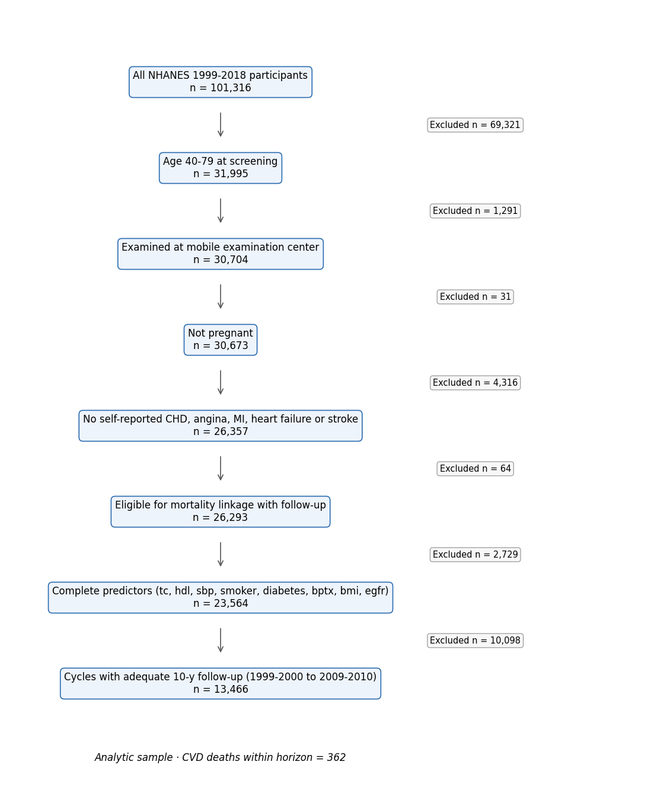
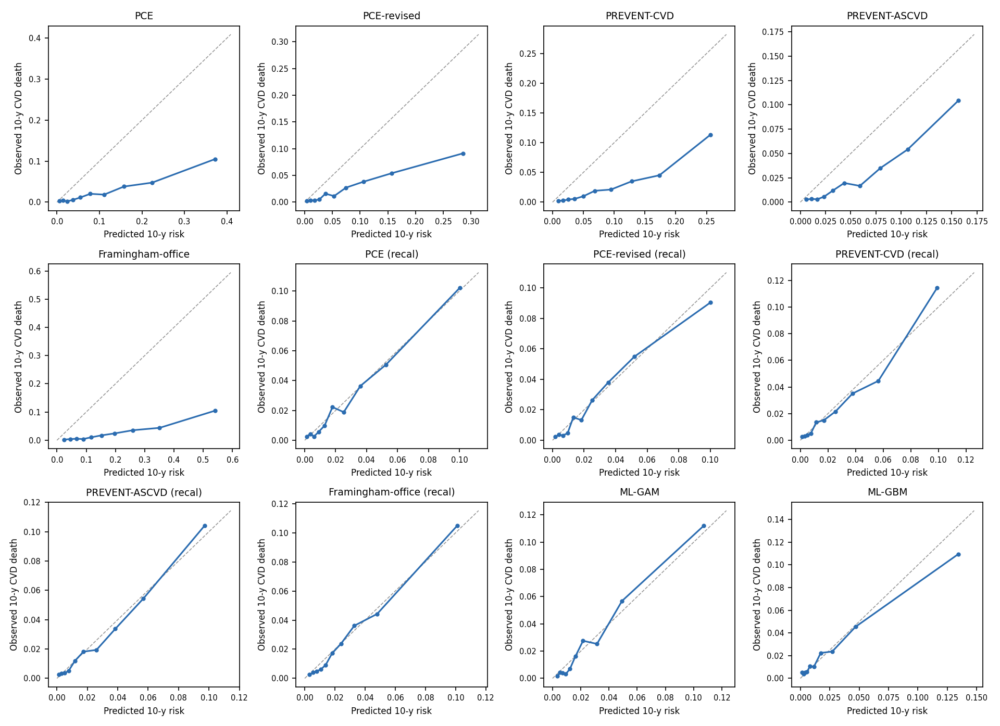
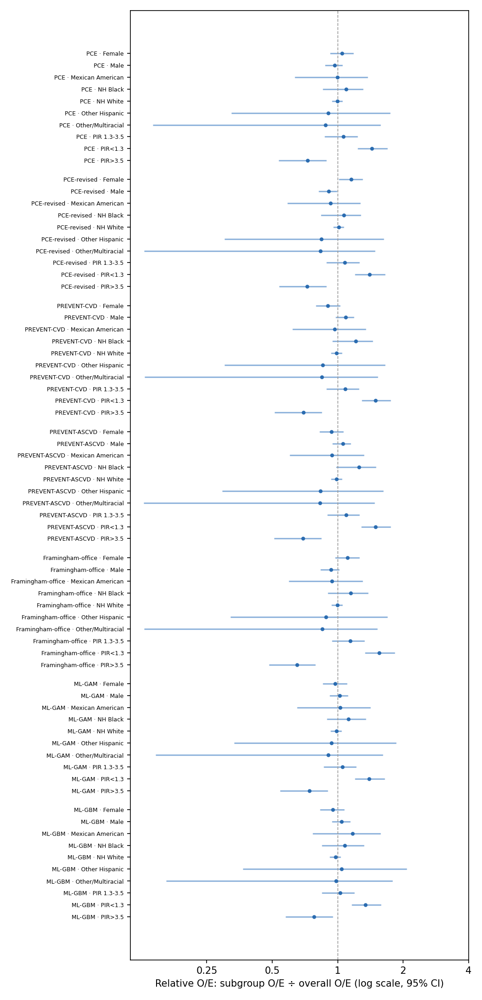

# EquiCVD Bench — run report (v1.0.0, scenario: main)

Run 2026-09-29T23:46:19+00:00 · horizon 10 y · B=200 Rao–Wu survey bootstrap · seed 20261101

## 1. Evaluation cohort

- Cycles evaluated: 1999-2000, 2001-2002, 2003-2004, 2005-2006, 2007-2008, 2009-2010
- Cycles dropped (censoring survival G(10y) < 0.1): 2011-2012, 2013-2014, 2015-2016, 2017-2018
- Participants: 13,466; CVD deaths within horizon: 362

**Table 1.** Baseline characteristics (survey-weighted mean (SD) or %; n unweighted)

| Characteristic | Overall | NH White | NH Black | Mexican American | Other Hispanic | Other/Multiracial |
|---|---|---|---|---|---|---|
| Participants, n | 13,466 | 6,689 | 2,577 | 2,794 | 929 | 477 |
| CVD deaths within horizon, n | 362 | 191 | 85 | 62 | 17 | 7 |
| Age, y | 54.2 (10.3) | 54.7 (10.4) | 52.9 (9.8) | 51.4 (9.7) | 52.8 (9.7) | 52.6 (9.0) |
| Total cholesterol, mg/dL | 208.8 (41.1) | 209.5 (40.2) | 202.2 (40.6) | 208.2 (39.1) | 213.4 (54.8) | 207.7 (43.5) |
| HDL cholesterol, mg/dL | 53.9 (16.6) | 54.2 (16.7) | 57.2 (17.8) | 49.6 (14.6) | 49.6 (13.4) | 53.2 (16.6) |
| Systolic BP, mmHg | 125.7 (18.2) | 125.1 (17.6) | 130.6 (20.3) | 125.9 (18.5) | 125.8 (19.8) | 125.4 (18.6) |
| BMI, kg/m² | 28.7 (6.3) | 28.6 (6.2) | 30.3 (7.3) | 29.5 (5.4) | 29.0 (5.2) | 26.7 (5.6) |
| eGFR, mL/min/1.73m² | 90.5 (16.5) | 89.7 (15.9) | 85.4 (18.6) | 99.9 (15.3) | 95.8 (16.2) | 96.7 (15.7) |
| Female, % | 52.7 | 52.2 | 54.9 | 49.3 | 54.9 | 57.4 |
| Current smoking, % | 20.3 | 19.2 | 28.4 | 19.1 | 19.5 | 23.1 |
| Diabetes, % | 11.1 | 8.8 | 18.4 | 19.2 | 17.7 | 17.7 |
| BP-lowering medication, % | 25.6 | 25.3 | 37.4 | 17.4 | 20.4 | 21.7 |
| Lipid-lowering medication, % | 16.1 | 16.7 | 13.9 | 12.2 | 15.4 | 16.0 |
| Income-to-poverty ratio < 1.3, % | 15.0 | 10.7 | 25.4 | 37.3 | 33.9 | 21.9 |
| Less than high school, % | 17.6 | 11.7 | 28.8 | 57.0 | 39.8 | 23.1 |

## 2a. Overall performance, as published (outcome: 10-year CVD death, NHANES public-use LMF)

| Tool | Target | Expected % | Observed % | O/E | Cal. slope | AUC | Scaled Brier | % ≥7.5% | TPR@7.5% |
|---|---|---|---|---|---|---|---|---|---|
| PCE | hard ASCVD | 8.2 (7.9–8.4) | 1.9 (1.6–2.2) | 0.23 (0.20–0.27) | 0.93 (0.79–1.10) | 0.804 (0.767–0.839) | -0.459 (-0.568–-0.351) | 34.5 (33.4–35.6) | 81.6 (75.1–88.3) |
| PCE-revised | hard ASCVD | 5.8 (5.6–6.0) | 1.9 (1.6–2.2) | 0.33 (0.29–0.38) | 0.94 (0.79–1.09) | 0.802 (0.765–0.833) | -0.180 (-0.241–-0.122) | 24.4 (23.5–25.5) | 68.7 (61.5–76.6) |
| PREVENT-CVD | total CVD (ASCVD+HF) | 6.8 (6.6–6.9) | 1.9 (1.6–2.2) | 0.28 (0.24–0.33) | 1.26 (1.08–1.51) | 0.810 (0.776–0.847) | -0.174 (-0.236–-0.117) | 30.5 (29.3–31.6) | 77.5 (71.0–83.6) |
| PREVENT-ASCVD | ASCVD | 4.2 (4.1–4.4) | 1.9 (1.6–2.2) | 0.45 (0.39–0.52) | 1.33 (1.11–1.62) | 0.806 (0.772–0.844) | -0.005 (-0.030–0.016) | 17.8 (17.0–18.8) | 63.1 (56.3–71.2) |
| Framingham-office | general CVD | 14.9 (14.6–15.3) | 1.9 (1.6–2.2) | 0.13 (0.11–0.15) | 0.97 (0.85–1.11) | 0.795 (0.762–0.827) | -1.543 (-1.821–-1.248) | 63.4 (62.2–64.7) | 92.6 (88.4–96.3) |
| ML-GAM | CVD death (trained here) | 2.0 (1.9–2.1) | 1.9 (1.6–2.2) | 0.94 (0.83–1.10) | 1.12 (0.99–1.26) | 0.818 (0.784–0.850) | 0.041 (0.026–0.058) | 4.3 (4.0–4.8) | 29.1 (21.8–36.4) |
| ML-GBM | CVD death (trained here) | 1.9 (1.8–2.0) | 1.9 (1.6–2.2) | 0.98 (0.86–1.14) | 0.79 (0.68–0.90) | 0.788 (0.747–0.826) | 0.027 (0.005–0.046) | 5.3 (4.8–5.7) | 33.5 (27.3–39.9) |

## 2b. Overall performance after logistic recalibration to CVD death (5-fold cross-fitted)

Recalibration refits only an intercept and slope on each tool's logit, so ranking (AUC) is unchanged; it answers "how fair is the tool once its absolute level is corrected for this outcome?"

| Tool | Target | Expected % | Observed % | O/E | Cal. slope | AUC | Scaled Brier | % ≥7.5% | TPR@7.5% |
|---|---|---|---|---|---|---|---|---|---|
| PCE (recal) | hard ASCVD → recalibrated to CVD death | 2.0 (1.9–2.1) | 1.9 (1.6–2.2) | 0.96 (0.84–1.12) | 1.02 (0.85–1.21) | 0.802 (0.763–0.838) | 0.034 (0.021–0.045) | 4.3 (4.0–4.7) | 26.0 (20.8–31.3) |
| PCE-revised (recal) | hard ASCVD → recalibrated to CVD death | 2.0 (2.0–2.1) | 1.9 (1.6–2.2) | 0.94 (0.83–1.10) | 1.03 (0.87–1.21) | 0.800 (0.762–0.832) | 0.032 (0.019–0.045) | 4.3 (3.9–4.7) | 24.0 (18.3–29.0) |
| PREVENT-CVD (recal) | total CVD (ASCVD+HF) → recalibrated to CVD death | 2.0 (1.9–2.0) | 1.9 (1.6–2.2) | 0.97 (0.85–1.13) | 1.05 (0.89–1.26) | 0.808 (0.773–0.846) | 0.041 (0.029–0.057) | 4.9 (4.5–5.3) | 30.0 (24.1–36.6) |
| PREVENT-ASCVD (recal) | ASCVD → recalibrated to CVD death | 2.0 (1.9–2.0) | 1.9 (1.6–2.2) | 0.96 (0.84–1.13) | 1.03 (0.85–1.26) | 0.804 (0.768–0.842) | 0.038 (0.026–0.052) | 4.7 (4.3–5.0) | 28.5 (22.7–35.0) |
| Framingham-office (recal) | general CVD → recalibrated to CVD death | 2.1 (2.0–2.1) | 1.9 (1.6–2.2) | 0.93 (0.81–1.08) | 1.07 (0.92–1.23) | 0.793 (0.760–0.825) | 0.029 (0.014–0.044) | 3.6 (3.3–3.9) | 23.0 (17.8–28.5) |

## 3. Subgroup calibration: relative O/E (subgroup O/E ÷ overall O/E; 1 = same as overall)

**sex**

| Tool | Female | Male |
|---|---|---|
| PCE | 1.04 (0.92–1.18) | 0.97 (0.87–1.05) |
| PCE-revised | 1.15 (1.01–1.30) | 0.91 (0.82–0.99) |
| PREVENT-CVD | 0.90 (0.79–1.03) | 1.09 (0.98–1.19) |
| PREVENT-ASCVD | 0.94 (0.82–1.06) | 1.05 (0.95–1.15) |
| Framingham-office | 1.11 (0.97–1.26) | 0.93 (0.83–1.02) |
| PCE (recal) | 1.04 (0.92–1.17) | 0.97 (0.88–1.06) |
| PCE-revised (recal) | 1.14 (1.00–1.28) | 0.92 (0.82–1.00) |
| PREVENT-CVD (recal) | 0.91 (0.80–1.03) | 1.08 (0.97–1.17) |
| PREVENT-ASCVD (recal) | 0.96 (0.85–1.08) | 1.03 (0.93–1.12) |
| Framingham-office (recal) | 1.15 (1.01–1.30) | 0.91 (0.82–0.99) |
| ML-GAM | 0.97 (0.85–1.10) | 1.02 (0.92–1.11) |
| ML-GBM | 0.95 (0.83–1.07) | 1.04 (0.94–1.14) |
| *events* | 145 | 217 |

**race**

| Tool | Mexican American | NH Black | NH White | Other Hispanic | Other/Multiracial |
|---|---|---|---|---|---|
| PCE | 0.99 (0.64–1.37) | 1.09 (0.85–1.31) | 1.00 (0.94–1.05) | 0.90 (0.32–1.74) | 0.88 (0.14–1.57) |
| PCE-revised | 0.93 (0.59–1.27) | 1.07 (0.84–1.28) | 1.01 (0.95–1.07) | 0.84 (0.30–1.62) | 0.83 (0.13–1.49) |
| PREVENT-CVD | 0.97 (0.62–1.34) | 1.21 (0.95–1.45) | 0.99 (0.93–1.04) | 0.85 (0.30–1.65) | 0.84 (0.13–1.53) |
| PREVENT-ASCVD | 0.94 (0.60–1.32) | 1.25 (0.98–1.50) | 0.99 (0.93–1.04) | 0.83 (0.29–1.62) | 0.83 (0.13–1.48) |
| Framingham-office | 0.94 (0.59–1.30) | 1.15 (0.90–1.38) | 1.00 (0.94–1.05) | 0.88 (0.32–1.69) | 0.85 (0.13–1.52) |
| PCE (recal) | 0.99 (0.63–1.36) | 1.08 (0.86–1.31) | 1.00 (0.94–1.05) | 0.90 (0.33–1.74) | 0.88 (0.14–1.59) |
| PCE-revised (recal) | 0.92 (0.59–1.27) | 1.07 (0.85–1.29) | 1.01 (0.95–1.07) | 0.84 (0.30–1.62) | 0.83 (0.13–1.49) |
| PREVENT-CVD (recal) | 0.97 (0.63–1.34) | 1.16 (0.91–1.40) | 0.99 (0.94–1.05) | 0.85 (0.30–1.66) | 0.87 (0.13–1.58) |
| PREVENT-ASCVD (recal) | 0.94 (0.61–1.30) | 1.21 (0.96–1.47) | 0.99 (0.93–1.05) | 0.82 (0.29–1.59) | 0.85 (0.13–1.55) |
| Framingham-office (recal) | 0.93 (0.61–1.28) | 1.09 (0.88–1.31) | 1.00 (0.94–1.05) | 0.88 (0.33–1.66) | 0.88 (0.14–1.60) |
| ML-GAM | 1.02 (0.65–1.41) | 1.12 (0.89–1.35) | 0.99 (0.93–1.04) | 0.94 (0.33–1.85) | 0.91 (0.15–1.61) |
| ML-GBM | 1.17 (0.77–1.58) | 1.08 (0.84–1.32) | 0.98 (0.92–1.03) | 1.04 (0.37–2.08) | 0.98 (0.16–1.78) |
| *events* | 62 | 85 | 191 | 17 | 7 |

**age_group**

| Tool | 40-49 | 50-59 | 60-69 | 70-79 |
|---|---|---|---|---|
| PCE | 0.94 (0.59–1.34) | 0.76 (0.56–1.00) | 0.93 (0.73–1.10) | 1.22 (1.02–1.43) |
| PCE-revised | 0.86 (0.55–1.23) | 0.69 (0.51–0.91) | 0.91 (0.72–1.07) | 1.39 (1.16–1.62) |
| PREVENT-CVD | 0.88 (0.55–1.26) | 0.70 (0.51–0.91) | 0.91 (0.71–1.07) | 1.37 (1.15–1.60) |
| PREVENT-ASCVD | 0.82 (0.52–1.17) | 0.68 (0.49–0.88) | 0.92 (0.72–1.09) | 1.44 (1.21–1.67) |
| Framingham-office | 0.70 (0.45–1.00) | 0.60 (0.44–0.78) | 0.93 (0.73–1.10) | 1.78 (1.50–2.05) |
| PCE (recal) | 0.95 (0.60–1.38) | 0.79 (0.58–1.04) | 0.97 (0.76–1.13) | 1.16 (0.96–1.36) |
| PCE-revised (recal) | 0.83 (0.53–1.19) | 0.69 (0.51–0.91) | 0.93 (0.73–1.09) | 1.39 (1.16–1.63) |
| PREVENT-CVD (recal) | 1.16 (0.72–1.67) | 0.81 (0.60–1.06) | 0.89 (0.70–1.04) | 1.13 (0.94–1.31) |
| PREVENT-ASCVD (recal) | 1.10 (0.68–1.58) | 0.78 (0.57–1.01) | 0.89 (0.70–1.04) | 1.18 (0.98–1.37) |
| Framingham-office (recal) | 0.79 (0.51–1.14) | 0.66 (0.48–0.86) | 0.91 (0.71–1.07) | 1.52 (1.27–1.76) |
| ML-GAM | 0.81 (0.51–1.17) | 0.85 (0.62–1.11) | 1.08 (0.85–1.26) | 1.10 (0.92–1.28) |
| ML-GBM | 1.03 (0.64–1.47) | 0.97 (0.72–1.27) | 0.95 (0.76–1.11) | 1.03 (0.87–1.18) |
| *events* | 35 | 45 | 102 | 180 |

**income**

| Tool | PIR 1.3-3.5 | PIR<1.3 | PIR>3.5 |
|---|---|---|---|
| PCE | 1.06 (0.87–1.24) | 1.43 (1.23–1.69) | 0.73 (0.54–0.89) |
| PCE-revised | 1.08 (0.88–1.26) | 1.40 (1.20–1.65) | 0.72 (0.54–0.89) |
| PREVENT-CVD | 1.08 (0.89–1.25) | 1.49 (1.29–1.75) | 0.70 (0.51–0.85) |
| PREVENT-ASCVD | 1.09 (0.90–1.26) | 1.49 (1.28–1.76) | 0.69 (0.51–0.84) |
| Framingham-office | 1.14 (0.94–1.33) | 1.55 (1.34–1.83) | 0.65 (0.48–0.79) |
| PCE (recal) | 1.05 (0.86–1.23) | 1.42 (1.21–1.68) | 0.74 (0.54–0.90) |
| PCE-revised (recal) | 1.08 (0.89–1.26) | 1.40 (1.20–1.65) | 0.72 (0.54–0.88) |
| PREVENT-CVD (recal) | 1.03 (0.85–1.20) | 1.43 (1.23–1.67) | 0.75 (0.55–0.91) |
| PREVENT-ASCVD (recal) | 1.04 (0.86–1.20) | 1.42 (1.22–1.67) | 0.74 (0.55–0.91) |
| Framingham-office (recal) | 1.12 (0.91–1.31) | 1.51 (1.30–1.77) | 0.67 (0.50–0.82) |
| ML-GAM | 1.05 (0.86–1.22) | 1.39 (1.20–1.65) | 0.74 (0.54–0.90) |
| ML-GBM | 1.03 (0.84–1.19) | 1.34 (1.16–1.58) | 0.78 (0.57–0.95) |
| *events* | 144 | 124 | 60 |

**education**

| Tool | <HS | College+ | HS/GED | Some college |
|---|---|---|---|---|
| PCE | 1.19 (1.00–1.43) | 0.83 (0.54–1.07) | 1.00 (0.75–1.21) | 0.95 (0.71–1.23) |
| PCE-revised | 1.16 (0.98–1.41) | 0.86 (0.56–1.10) | 1.00 (0.75–1.22) | 0.95 (0.71–1.23) |
| PREVENT-CVD | 1.25 (1.05–1.51) | 0.79 (0.51–1.02) | 1.02 (0.76–1.24) | 0.93 (0.69–1.19) |
| PREVENT-ASCVD | 1.26 (1.06–1.52) | 0.79 (0.51–1.03) | 1.02 (0.76–1.24) | 0.92 (0.68–1.18) |
| Framingham-office | 1.30 (1.09–1.58) | 0.77 (0.49–0.98) | 1.04 (0.77–1.26) | 0.91 (0.67–1.16) |
| PCE (recal) | 1.17 (0.99–1.41) | 0.84 (0.54–1.08) | 1.00 (0.75–1.22) | 0.96 (0.71–1.25) |
| PCE-revised (recal) | 1.16 (0.98–1.41) | 0.86 (0.56–1.10) | 1.01 (0.76–1.23) | 0.95 (0.71–1.23) |
| PREVENT-CVD (recal) | 1.16 (0.97–1.39) | 0.84 (0.54–1.09) | 1.01 (0.75–1.23) | 0.97 (0.72–1.24) |
| PREVENT-ASCVD (recal) | 1.16 (0.98–1.40) | 0.84 (0.55–1.10) | 1.01 (0.75–1.24) | 0.96 (0.71–1.23) |
| Framingham-office (recal) | 1.23 (1.04–1.47) | 0.79 (0.52–1.01) | 1.02 (0.77–1.25) | 0.94 (0.70–1.20) |
| ML-GAM | 1.17 (0.98–1.41) | 0.83 (0.55–1.07) | 1.00 (0.75–1.20) | 0.97 (0.72–1.23) |
| ML-GBM | 1.15 (0.97–1.39) | 0.85 (0.57–1.08) | 0.98 (0.73–1.17) | 0.99 (0.73–1.28) |
| *events* | 151 | 48 | 90 | 71 |

## 4. Fairness gaps across subgroups (95% basic bootstrap CI)

Subgroups with < 10 horizon events are excluded from gap summaries.

| Tool | Attribute | O/E max÷min | AUC max−min | TPR@7.5% max−min | FPR@7.5% max−min |
|---|---|---|---|---|---|
| PCE | sex | 1.08 (1.00–1.15) | 0.037 (0.000–0.070) | 6.8 (0.0–13.1) | 19.2 (17.5–21.3) |
| PCE | race | 1.21 (1.00–1.36) | 0.113 (0.025–0.199) | 28.5 (2.8–51.2) | 16.6 (13.2–19.4) |
| PCE | age_group | 1.60 (1.00–1.97) | 0.117 (0.000–0.179) | 65.5 (49.1–81.1) | 91.1 (89.9–92.3) |
| PCE | income | 1.98 (1.08–2.42) | 0.079 (0.000–0.132) | 21.6 (6.9–36.9) | 16.6 (13.8–18.9) |
| PCE | education | 1.43 (1.00–1.68) | 0.080 (0.000–0.115) | 20.5 (0.7–33.9) | 25.1 (21.6–28.3) |
| PCE-revised | sex | 1.27 (1.00–1.48) | 0.037 (0.000–0.070) | 18.6 (6.7–30.5) | 18.1 (16.6–19.8) |
| PCE-revised | race | 1.27 (1.00–1.48) | 0.097 (0.022–0.163) | 39.3 (26.4–73.2) | 11.3 (7.3–14.0) |
| PCE-revised | age_group | 2.00 (1.00–2.51) | 0.136 (0.000–0.203) | 67.7 (48.4–78.8) | 75.8 (73.8–77.7) |
| PCE-revised | income | 1.94 (1.04–2.38) | 0.068 (0.000–0.113) | 25.3 (8.5–39.8) | 13.2 (10.5–14.7) |
| PCE-revised | education | 1.35 (1.00–1.54) | 0.076 (0.000–0.111) | 19.2 (0.0–30.2) | 22.6 (19.6–25.6) |
| PREVENT-CVD | sex | 1.21 (1.00–1.40) | 0.023 (0.000–0.045) | 0.6 (0.0–0.8) | 5.2 (3.5–7.2) |
| PREVENT-CVD | race | 1.42 (1.00–1.77) | 0.123 (0.027–0.223) | 21.4 (0.0–37.7) | 8.6 (4.4–11.8) |
| PREVENT-CVD | age_group | 1.97 (1.00–2.48) | 0.146 (0.000–0.230) | 67.3 (48.4–81.3) | 95.7 (94.9–96.5) |
| PREVENT-CVD | income | 2.14 (1.19–2.64) | 0.061 (0.000–0.104) | 25.8 (9.6–42.5) | 16.2 (13.7–18.8) |
| PREVENT-CVD | education | 1.59 (1.00–1.89) | 0.068 (0.000–0.099) | 21.9 (4.2–32.7) | 21.7 (18.4–24.6) |
| PREVENT-ASCVD | sex | 1.13 (1.00–1.25) | 0.031 (0.000–0.061) | 3.3 (0.0–6.1) | 5.0 (3.7–6.3) |
| PREVENT-ASCVD | race | 1.51 (1.00–1.93) | 0.117 (0.026–0.211) | 31.7 (16.0–59.5) | 4.1 (0.6–6.6) |
| PREVENT-ASCVD | age_group | 2.13 (1.00–2.75) | 0.132 (0.000–0.210) | 83.2 (71.2–92.7) | 83.6 (82.0–85.2) |
| PREVENT-ASCVD | income | 2.16 (1.20–2.67) | 0.056 (0.000–0.099) | 28.1 (9.7–44.2) | 12.6 (10.9–14.2) |
| PREVENT-ASCVD | education | 1.59 (1.00–1.90) | 0.069 (0.000–0.102) | 21.4 (3.9–33.5) | 17.6 (15.4–19.7) |
| Framingham-office | sex | 1.19 (1.00–1.39) | 0.007 (0.000–0.013) | 9.9 (2.1–16.6) | 34.0 (32.1–36.6) |
| Framingham-office | race | 1.30 (1.00–1.53) | 0.158 (0.057–0.292) | 13.6 (0.0–23.1) | 15.1 (10.9–19.0) |
| Framingham-office | age_group | 2.95 (1.11–3.79) | 0.139 (0.000–0.209) | 22.8 (6.4–34.0) | 64.6 (63.0–66.6) |
| Framingham-office | income | 2.39 (1.35–2.99) | 0.068 (0.000–0.113) | 6.1 (0.0–10.5) | 11.5 (8.9–14.2) |
| Framingham-office | education | 1.70 (1.00–2.04) | 0.074 (0.000–0.111) | 7.0 (0.0–11.1) | 20.2 (17.0–22.7) |
| PCE (recal) | sex | 1.07 (1.00–1.12) | 0.037 (0.000–0.071) | 2.8 (0.0–5.4) | 1.9 (1.2–2.6) |
| PCE (recal) | race | 1.20 (1.00–1.33) | 0.102 (0.016–0.178) | 12.2 (0.0–21.6) | 1.5 (0.5–2.5) |
| PCE (recal) | age_group | 1.47 (1.00–1.76) | 0.110 (0.000–0.169) | 50.1 (40.7–60.0) | 29.2 (26.7–31.7) |
| PCE (recal) | income | 1.93 (1.04–2.38) | 0.077 (0.000–0.125) | 22.9 (11.7–35.9) | 3.8 (2.7–4.8) |
| PCE (recal) | education | 1.39 (1.00–1.61) | 0.079 (0.000–0.114) | 22.5 (10.4–32.0) | 5.4 (4.0–6.5) |
| PCE-revised (recal) | sex | 1.24 (1.00–1.45) | 0.035 (0.000–0.068) | 0.0 (0.0–-0.2) | 3.2 (2.5–4.0) |
| PCE-revised (recal) | race | 1.28 (1.00–1.51) | 0.091 (0.018–0.151) | 9.5 (0.0–15.2) | 1.7 (0.4–2.4) |
| PCE-revised (recal) | age_group | 2.01 (1.00–2.56) | 0.128 (0.000–0.191) | 42.0 (33.8–49.9) | 20.6 (18.4–22.9) |
| PCE-revised (recal) | income | 1.95 (1.04–2.39) | 0.068 (0.000–0.113) | 13.6 (0.0–20.8) | 4.1 (3.0–5.1) |
| PCE-revised (recal) | education | 1.35 (1.00–1.56) | 0.075 (0.000–0.110) | 18.4 (4.7–27.7) | 6.1 (4.9–7.4) |
| PREVENT-CVD (recal) | sex | 1.18 (1.00–1.36) | 0.024 (0.000–0.047) | 3.9 (0.0–7.5) | 1.9 (1.1–2.7) |
| PREVENT-CVD (recal) | race | 1.36 (1.00–1.64) | 0.110 (0.016–0.201) | 19.4 (0.0–33.0) | 3.5 (2.0–5.6) |
| PREVENT-CVD (recal) | age_group | 1.44 (1.00–1.67) | 0.136 (0.000–0.224) | 55.4 (47.3–64.1) | 31.3 (28.5–33.9) |
| PREVENT-CVD (recal) | income | 1.91 (1.03–2.35) | 0.063 (0.000–0.108) | 21.2 (8.0–31.3) | 4.7 (3.5–5.3) |
| PREVENT-CVD (recal) | education | 1.39 (1.00–1.60) | 0.065 (0.000–0.094) | 27.0 (13.7–39.0) | 7.0 (5.8–8.2) |
| PREVENT-ASCVD (recal) | sex | 1.08 (1.00–1.15) | 0.031 (0.000–0.062) | 3.6 (0.0–6.9) | 2.8 (2.2–3.6) |
| PREVENT-ASCVD (recal) | race | 1.48 (1.00–1.88) | 0.107 (0.020–0.191) | 8.8 (0.0–15.0) | 1.9 (0.8–2.9) |
| PREVENT-ASCVD (recal) | age_group | 1.53 (1.00–1.79) | 0.124 (0.000–0.200) | 50.8 (42.2–59.3) | 27.6 (25.0–30.1) |
| PREVENT-ASCVD (recal) | income | 1.91 (1.05–2.35) | 0.058 (0.000–0.101) | 18.9 (4.6–30.9) | 4.3 (3.3–5.1) |
| PREVENT-ASCVD (recal) | education | 1.38 (1.00–1.59) | 0.065 (0.000–0.095) | 17.1 (1.5–26.5) | 7.3 (5.9–8.6) |
| Framingham-office (recal) | sex | 1.27 (1.00–1.51) | 0.005 (0.000–0.010) | 15.5 (5.3–24.0) | 3.4 (2.6–4.1) |
| Framingham-office (recal) | race | 1.24 (1.00–1.42) | 0.150 (0.049–0.277) | 9.4 (0.0–15.7) | 2.7 (1.7–3.6) |
| Framingham-office (recal) | age_group | 2.32 (1.03–2.98) | 0.135 (0.000–0.204) | 29.1 (15.8–37.4) | 17.4 (14.9–19.9) |
| Framingham-office (recal) | income | 2.25 (1.24–2.80) | 0.067 (0.000–0.112) | 17.7 (5.8–26.6) | 3.0 (2.0–3.7) |
| Framingham-office (recal) | education | 1.55 (1.00–1.84) | 0.074 (0.000–0.112) | 19.0 (3.2–25.7) | 4.9 (3.6–6.2) |
| ML-GAM | sex | 1.05 (1.00–1.09) | 0.023 (0.000–0.044) | 1.9 (0.0–3.6) | 1.7 (1.1–2.2) |
| ML-GAM | race | 1.20 (1.00–1.33) | 0.125 (0.041–0.216) | 13.0 (0.0–23.9) | 2.3 (1.1–3.7) |
| ML-GAM | age_group | 1.37 (1.00–1.55) | 0.118 (0.000–0.191) | 60.4 (50.7–71.2) | 31.3 (28.1–34.7) |
| ML-GAM | income | 1.88 (1.03–2.29) | 0.068 (0.000–0.114) | 25.7 (10.8–38.3) | 4.1 (3.1–4.8) |
| ML-GAM | education | 1.41 (1.00–1.63) | 0.093 (0.000–0.145) | 14.9 (0.0–22.3) | 5.9 (4.6–7.2) |
| ML-GBM | sex | 1.10 (1.00–1.19) | 0.018 (0.000–0.032) | 0.5 (0.0–0.8) | 1.7 (1.0–2.4) |
| ML-GBM | race | 1.20 (1.00–1.32) | 0.094 (0.000–0.159) | 28.0 (19.8–50.1) | 3.1 (1.9–4.5) |
| ML-GBM | age_group | 1.09 (1.00–1.05) | 0.051 (0.000–0.073) | 45.9 (28.3–56.0) | 30.0 (26.9–32.8) |
| ML-GBM | income | 1.72 (1.02–2.09) | 0.097 (0.009–0.154) | 24.2 (11.1–39.9) | 5.0 (3.5–6.2) |
| ML-GBM | education | 1.35 (1.00–1.54) | 0.101 (0.000–0.156) | 30.4 (14.1–41.6) | 5.5 (4.2–6.7) |

## 5. Explainability (ML-GBM, out-of-fold permutation importance, drop in AUC)

| Feature | ΔAUC (mean ± SD across folds) |
|---|---|
| age | 0.1264 ± 0.0113 |
| sbp | 0.0182 ± 0.0068 |
| female | 0.0161 ± 0.0076 |
| smoker | 0.0145 ± 0.0059 |
| bmi | 0.0116 ± 0.0120 |
| egfr | 0.0092 ± 0.0031 |
| hdl | 0.0091 ± 0.0063 |
| diabetes | 0.0071 ± 0.0038 |
| bptx | 0.0069 ± 0.0040 |
| tc | 0.0035 ± 0.0105 |
| statin | -0.0001 ± 0.0017 |

ML-GAM partial log-odds shape functions: `ml_gam_shape_functions.csv`.

## 6. Interpretation notes and known limitations

- **Outcome mismatch.** Public-use LMF supports CVD *mortality* (UCOD 001 heart disease, 005 cerebrovascular), not incident ASCVD. O/E < 1 for as-published PCE/PREVENT is expected by construction; subgroup *relative* O/E, the recalibrated results, and the gap metrics are the fairness-relevant quantities. ML comparators are trained on this outcome and so bound what is achievable here.
- **Competing risks.** Non-CVD deaths before the horizon are known non-events (cumulative-incidence estimand).
- **Censoring.** IPCW with Kaplan–Meier censoring estimated within cycle.
- **What the CIs cover.** IPCW weights, recalibration fits and ML fits are held fixed across bootstrap replicates, so CIs reflect sampling of participants/PSUs but not model-fitting variability. Cross-fitting (5 folds) removes in-sample optimism from the point estimates.
- **Gap CIs** use basic (reflected) bootstrap intervals because max/min statistics are biased upward under resampling; all other CIs are percentile intervals.
- **Age-group threshold gaps** (TPR/FPR) mostly reflect that age is a dominant predictor, not unfairness.
- **Predictors.** Lipid-lowering medication (BPQ100D) proxies statin use; eGFR is CKD-EPI 2021 on standardized creatinine; out-of-range inputs are clipped to each equation's valid range unless excluded.
- **Public-use perturbation.** NCHS perturbs some follow-up/cause fields in public-use LMF; results should be confirmed against restricted-use files before clinical interpretation.

## Figures

