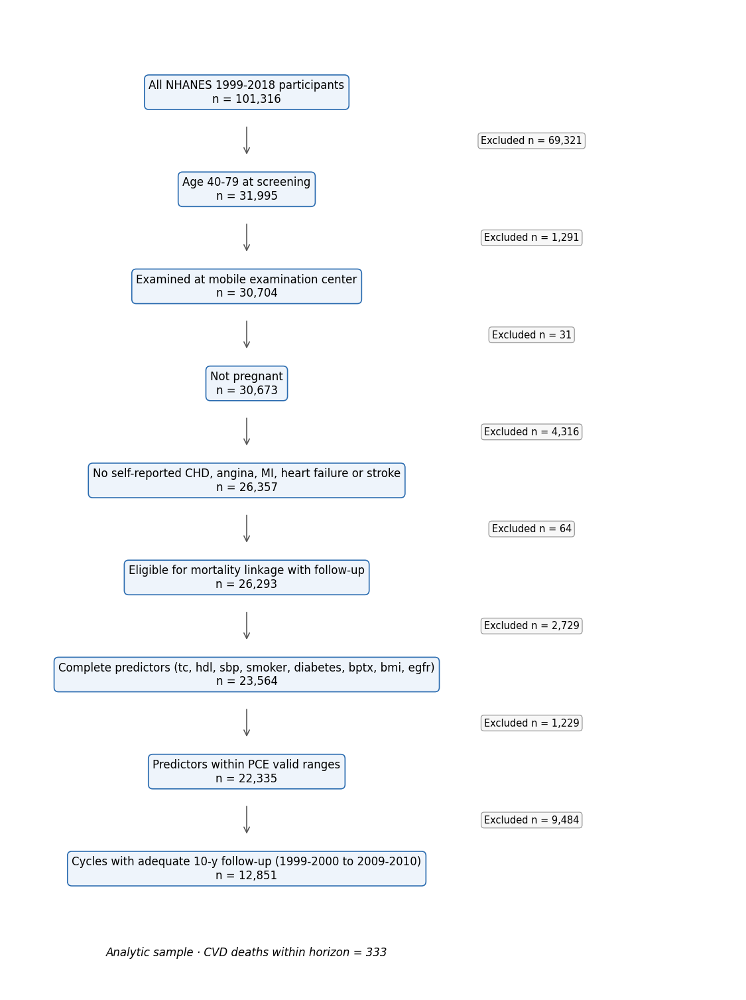
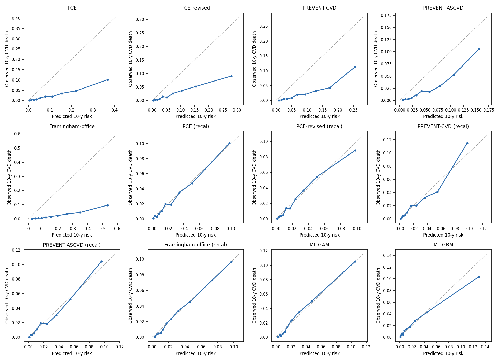
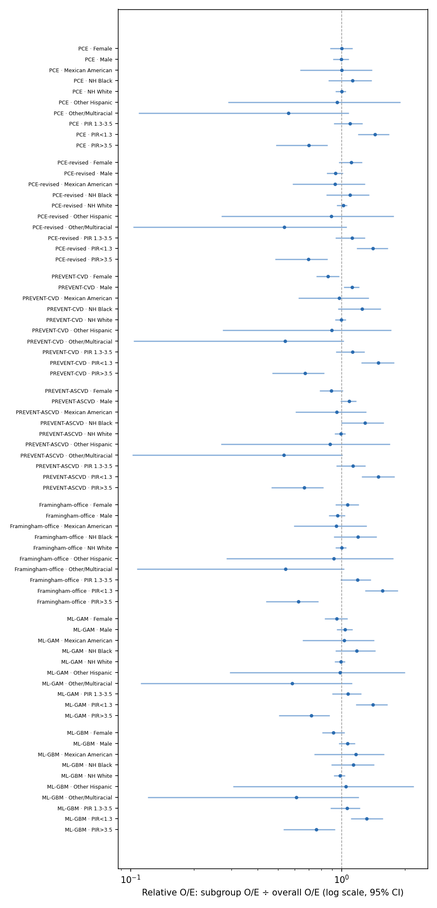

# EquiCVD Bench — run report (v1.0.0rc1, scenario: exclude_out_of_range)

Run 2026-09-29T17:09:22+00:00 · horizon 10 y · B=200 Rao–Wu survey bootstrap · seed 20261101 · out-of-range participants excluded

## 1. Evaluation cohort

- Cycles evaluated: 1999-2000, 2001-2002, 2003-2004, 2005-2006, 2007-2008, 2009-2010
- Cycles dropped (censoring survival G(10y) < 0.1): 2011-2012, 2013-2014, 2015-2016, 2017-2018
- Participants: 12,851; CVD deaths within horizon: 333

**Table 1.** Baseline characteristics (survey-weighted mean (SD) or %; n unweighted)

| Characteristic | Overall | NH White | NH Black | Mexican American | Other Hispanic | Other/Multiracial |
|---|---|---|---|---|---|---|
| Participants, n | 12,851 | 6,377 | 2,419 | 2,701 | 901 | 453 |
| CVD deaths within horizon, n | 333 | 177 | 80 | 55 | 16 | 5 |
| Age, y | 54.1 (10.2) | 54.7 (10.4) | 53.0 (9.8) | 51.3 (9.6) | 53.0 (9.7) | 52.6 (9.0) |
| Total cholesterol, mg/dL | 208.4 (36.5) | 209.2 (36.3) | 202.6 (36.4) | 207.8 (36.2) | 209.8 (36.2) | 207.4 (38.2) |
| HDL cholesterol, mg/dL | 53.4 (15.2) | 53.6 (15.4) | 56.0 (15.1) | 49.2 (13.3) | 49.7 (13.3) | 52.7 (14.9) |
| Systolic BP, mmHg | 125.7 (17.6) | 125.1 (17.1) | 130.3 (19.6) | 125.7 (17.8) | 125.7 (19.4) | 125.6 (18.5) |
| BMI, kg/m² | 28.8 (6.3) | 28.6 (6.2) | 30.4 (7.3) | 29.6 (5.3) | 28.9 (5.2) | 26.8 (5.6) |
| eGFR, mL/min/1.73m² | 90.5 (16.4) | 89.7 (15.8) | 85.4 (18.6) | 99.9 (15.3) | 95.7 (16.0) | 96.5 (15.7) |
| Female, % | 52.3 | 51.8 | 54.7 | 49.1 | 55.4 | 56.5 |
| Current smoking, % | 20.1 | 19.1 | 28.4 | 18.8 | 19.4 | 23.2 |
| Diabetes, % | 10.8 | 8.6 | 18.4 | 19.0 | 16.2 | 16.6 |
| BP-lowering medication, % | 25.6 | 25.4 | 37.3 | 17.1 | 20.1 | 21.5 |
| Lipid-lowering medication, % | 16.1 | 16.7 | 14.2 | 12.0 | 15.1 | 15.9 |
| Income-to-poverty ratio < 1.3, % | 14.8 | 10.5 | 25.3 | 37.0 | 34.1 | 22.0 |
| Less than high school, % | 17.6 | 11.7 | 28.5 | 56.7 | 39.7 | 22.3 |

## 2a. Overall performance, as published (outcome: 10-year CVD death, NHANES public-use LMF)

| Tool | Target | Expected % | Observed % | O/E | Cal. slope | AUC | Scaled Brier | % ≥7.5% | TPR@7.5% |
|---|---|---|---|---|---|---|---|---|---|
| PCE | hard ASCVD | 8.1 (7.9–8.4) | 1.8 (1.5–2.2) | 0.22 (0.19–0.27) | 0.98 (0.85–1.15) | 0.814 (0.779–0.851) | -0.474 (-0.603–-0.353) | 34.3 (33.2–35.3) | 82.6 (76.4–88.6) |
| PCE-revised | hard ASCVD | 5.8 (5.6–5.9) | 1.8 (1.5–2.2) | 0.32 (0.27–0.38) | 0.99 (0.86–1.15) | 0.811 (0.780–0.843) | -0.180 (-0.249–-0.122) | 24.2 (23.2–25.3) | 68.6 (61.7–76.5) |
| PREVENT-CVD | total CVD (ASCVD+HF) | 6.7 (6.5–6.9) | 1.8 (1.5–2.2) | 0.27 (0.23–0.32) | 1.33 (1.16–1.57) | 0.822 (0.791–0.857) | -0.182 (-0.254–-0.117) | 30.4 (29.2–31.6) | 78.2 (71.0–84.6) |
| PREVENT-ASCVD | ASCVD | 4.2 (4.1–4.3) | 1.8 (1.5–2.2) | 0.43 (0.37–0.52) | 1.42 (1.22–1.68) | 0.818 (0.785–0.854) | -0.006 (-0.034–0.018) | 17.7 (16.9–18.6) | 62.8 (55.8–70.8) |
| Framingham-office | general CVD | 14.9 (14.5–15.2) | 1.8 (1.5–2.2) | 0.12 (0.10–0.15) | 1.00 (0.88–1.15) | 0.801 (0.769–0.834) | -1.601 (-1.941–-1.302) | 63.5 (62.2–64.7) | 93.7 (89.7–97.3) |
| ML-GAM | CVD death (trained here) | 1.9 (1.9–2.0) | 1.8 (1.5–2.2) | 0.94 (0.81–1.12) | 1.12 (0.99–1.27) | 0.824 (0.793–0.860) | 0.041 (0.025–0.057) | 4.3 (3.9–4.7) | 29.1 (22.5–37.3) |
| ML-GBM | CVD death (trained here) | 1.8 (1.8–1.9) | 1.8 (1.5–2.2) | 0.99 (0.85–1.20) | 0.83 (0.73–0.93) | 0.803 (0.769–0.835) | 0.032 (0.010–0.050) | 4.9 (4.5–5.3) | 30.7 (24.6–36.0) |

## 2b. Overall performance after logistic recalibration to CVD death (5-fold cross-fitted)

Recalibration refits only an intercept and slope on each tool's logit, so ranking (AUC) is unchanged; it answers "how fair is the tool once its absolute level is corrected for this outcome?"

| Tool | Target | Expected % | Observed % | O/E | Cal. slope | AUC | Scaled Brier | % ≥7.5% | TPR@7.5% |
|---|---|---|---|---|---|---|---|---|---|
| PCE (recal) | hard ASCVD → recalibrated to CVD death | 1.9 (1.8–2.0) | 1.8 (1.5–2.2) | 0.96 (0.83–1.14) | 1.05 (0.91–1.24) | 0.814 (0.779–0.851) | 0.035 (0.022–0.048) | 4.1 (3.7–4.5) | 24.5 (19.4–30.3) |
| PCE-revised (recal) | hard ASCVD → recalibrated to CVD death | 1.9 (1.9–2.0) | 1.8 (1.5–2.2) | 0.94 (0.81–1.12) | 1.08 (0.94–1.26) | 0.810 (0.779–0.842) | 0.033 (0.021–0.048) | 4.0 (3.6–4.4) | 22.8 (17.6–27.9) |
| PREVENT-CVD (recal) | total CVD (ASCVD+HF) → recalibrated to CVD death | 1.9 (1.8–2.0) | 1.8 (1.5–2.2) | 0.97 (0.83–1.15) | 1.09 (0.95–1.28) | 0.821 (0.791–0.856) | 0.043 (0.030–0.060) | 4.6 (4.2–5.0) | 29.7 (23.8–36.9) |
| PREVENT-ASCVD (recal) | ASCVD → recalibrated to CVD death | 1.9 (1.8–2.0) | 1.8 (1.5–2.2) | 0.96 (0.83–1.15) | 1.07 (0.92–1.27) | 0.817 (0.785–0.853) | 0.040 (0.028–0.056) | 4.5 (4.1–4.9) | 27.4 (22.3–34.4) |
| Framingham-office (recal) | general CVD → recalibrated to CVD death | 2.0 (1.9–2.1) | 1.8 (1.5–2.2) | 0.92 (0.79–1.09) | 1.10 (0.97–1.27) | 0.800 (0.769–0.834) | 0.029 (0.015–0.044) | 3.4 (3.0–3.7) | 21.7 (16.4–27.1) |

## 3. Subgroup calibration: relative O/E (subgroup O/E ÷ overall O/E; 1 = same as overall)

**sex**

| Tool | Female | Male |
|---|---|---|
| PCE | 1.00 (0.88–1.13) | 1.00 (0.91–1.08) |
| PCE-revised | 1.11 (0.97–1.25) | 0.94 (0.85–1.02) |
| PREVENT-CVD | 0.86 (0.76–0.97) | 1.12 (1.02–1.21) |
| PREVENT-ASCVD | 0.90 (0.79–1.01) | 1.09 (0.99–1.17) |
| Framingham-office | 1.07 (0.94–1.21) | 0.96 (0.87–1.04) |
| PCE (recal) | 1.00 (0.88–1.12) | 1.00 (0.91–1.09) |
| PCE-revised (recal) | 1.10 (0.96–1.24) | 0.94 (0.85–1.02) |
| PREVENT-CVD (recal) | 0.87 (0.77–0.98) | 1.11 (1.02–1.21) |
| PREVENT-ASCVD (recal) | 0.92 (0.81–1.04) | 1.06 (0.97–1.15) |
| Framingham-office (recal) | 1.12 (0.97–1.26) | 0.93 (0.85–1.02) |
| ML-GAM | 0.95 (0.83–1.07) | 1.04 (0.95–1.13) |
| ML-GBM | 0.92 (0.81–1.03) | 1.07 (0.97–1.16) |
| *events* | 129 | 204 |

**race**

| Tool | Mexican American | NH Black | NH White | Other Hispanic | Other/Multiracial |
|---|---|---|---|---|---|
| PCE | 1.00 (0.64–1.39) | 1.13 (0.87–1.39) | 1.00 (0.94–1.05) | 0.95 (0.29–1.90) | 0.56 (0.11–1.08) |
| PCE-revised | 0.93 (0.59–1.29) | 1.10 (0.85–1.35) | 1.02 (0.95–1.06) | 0.89 (0.27–1.77) | 0.53 (0.10–1.06) |
| PREVENT-CVD | 0.97 (0.62–1.35) | 1.25 (0.96–1.53) | 1.00 (0.93–1.05) | 0.90 (0.27–1.72) | 0.54 (0.10–1.03) |
| PREVENT-ASCVD | 0.95 (0.61–1.31) | 1.29 (1.00–1.58) | 0.99 (0.93–1.04) | 0.88 (0.27–1.70) | 0.53 (0.10–1.01) |
| Framingham-office | 0.94 (0.59–1.32) | 1.19 (0.92–1.47) | 1.00 (0.94–1.05) | 0.92 (0.28–1.76) | 0.54 (0.11–1.03) |
| PCE (recal) | 0.99 (0.63–1.38) | 1.12 (0.87–1.38) | 1.00 (0.94–1.05) | 0.96 (0.29–1.90) | 0.56 (0.11–1.10) |
| PCE-revised (recal) | 0.93 (0.58–1.28) | 1.10 (0.85–1.36) | 1.02 (0.95–1.06) | 0.89 (0.27–1.75) | 0.53 (0.10–1.06) |
| PREVENT-CVD (recal) | 0.98 (0.63–1.35) | 1.18 (0.92–1.44) | 1.00 (0.93–1.05) | 0.91 (0.27–1.81) | 0.56 (0.11–1.10) |
| PREVENT-ASCVD (recal) | 0.95 (0.61–1.31) | 1.24 (0.97–1.51) | 1.00 (0.93–1.04) | 0.88 (0.26–1.79) | 0.55 (0.10–1.09) |
| Framingham-office (recal) | 0.94 (0.60–1.30) | 1.13 (0.90–1.39) | 1.01 (0.94–1.06) | 0.92 (0.29–1.82) | 0.56 (0.11–1.10) |
| ML-GAM | 1.03 (0.65–1.43) | 1.18 (0.93–1.44) | 0.99 (0.93–1.04) | 0.98 (0.30–2.00) | 0.58 (0.11–1.12) |
| ML-GBM | 1.17 (0.74–1.59) | 1.14 (0.89–1.43) | 0.98 (0.92–1.04) | 1.05 (0.31–2.19) | 0.61 (0.12–1.21) |
| *events* | 55 | 80 | 177 | 16 | 5 |

**age_group**

| Tool | 40-49 | 50-59 | 60-69 | 70-79 |
|---|---|---|---|---|
| PCE | 0.95 (0.59–1.39) | 0.75 (0.54–1.01) | 0.89 (0.70–1.06) | 1.26 (1.08–1.46) |
| PCE-revised | 0.87 (0.54–1.26) | 0.69 (0.49–0.92) | 0.87 (0.68–1.03) | 1.43 (1.22–1.65) |
| PREVENT-CVD | 0.89 (0.55–1.28) | 0.69 (0.49–0.91) | 0.86 (0.68–1.02) | 1.42 (1.22–1.64) |
| PREVENT-ASCVD | 0.84 (0.52–1.20) | 0.67 (0.48–0.89) | 0.87 (0.69–1.04) | 1.48 (1.28–1.72) |
| Framingham-office | 0.71 (0.44–1.03) | 0.59 (0.42–0.79) | 0.88 (0.70–1.05) | 1.84 (1.57–2.13) |
| PCE (recal) | 1.00 (0.62–1.46) | 0.79 (0.56–1.06) | 0.91 (0.72–1.09) | 1.17 (1.00–1.36) |
| PCE-revised (recal) | 0.86 (0.53–1.24) | 0.69 (0.49–0.92) | 0.88 (0.68–1.05) | 1.42 (1.21–1.64) |
| PREVENT-CVD (recal) | 1.23 (0.74–1.79) | 0.82 (0.59–1.09) | 0.85 (0.67–1.01) | 1.14 (0.98–1.33) |
| PREVENT-ASCVD (recal) | 1.19 (0.71–1.72) | 0.79 (0.56–1.05) | 0.84 (0.66–1.00) | 1.19 (1.02–1.37) |
| Framingham-office (recal) | 0.80 (0.50–1.16) | 0.65 (0.46–0.86) | 0.87 (0.68–1.03) | 1.58 (1.34–1.83) |
| ML-GAM | 0.83 (0.52–1.21) | 0.86 (0.61–1.14) | 1.02 (0.80–1.22) | 1.12 (0.96–1.29) |
| ML-GBM | 1.12 (0.70–1.61) | 0.99 (0.70–1.31) | 0.91 (0.72–1.09) | 1.02 (0.87–1.18) |
| *events* | 33 | 40 | 92 | 168 |

**income**

| Tool | PIR 1.3-3.5 | PIR<1.3 | PIR>3.5 |
|---|---|---|---|
| PCE | 1.10 (0.92–1.25) | 1.44 (1.20–1.68) | 0.70 (0.49–0.86) |
| PCE-revised | 1.12 (0.94–1.29) | 1.41 (1.18–1.66) | 0.69 (0.48–0.86) |
| PREVENT-CVD | 1.12 (0.94–1.29) | 1.49 (1.24–1.77) | 0.67 (0.47–0.83) |
| PREVENT-ASCVD | 1.13 (0.95–1.29) | 1.50 (1.25–1.78) | 0.67 (0.47–0.82) |
| Framingham-office | 1.19 (0.99–1.37) | 1.56 (1.29–1.85) | 0.63 (0.44–0.78) |
| PCE (recal) | 1.08 (0.91–1.24) | 1.41 (1.18–1.66) | 0.71 (0.50–0.87) |
| PCE-revised (recal) | 1.12 (0.94–1.29) | 1.40 (1.17–1.65) | 0.70 (0.48–0.86) |
| PREVENT-CVD (recal) | 1.07 (0.90–1.23) | 1.41 (1.19–1.67) | 0.73 (0.51–0.89) |
| PREVENT-ASCVD (recal) | 1.07 (0.90–1.23) | 1.41 (1.19–1.67) | 0.72 (0.50–0.89) |
| Framingham-office (recal) | 1.16 (0.97–1.35) | 1.51 (1.26–1.77) | 0.65 (0.45–0.80) |
| ML-GAM | 1.07 (0.90–1.24) | 1.40 (1.17–1.65) | 0.72 (0.50–0.88) |
| ML-GBM | 1.06 (0.88–1.22) | 1.32 (1.11–1.57) | 0.76 (0.53–0.93) |
| *events* | 134 | 113 | 55 |

**education**

| Tool | <HS | College+ | HS/GED | Some college |
|---|---|---|---|---|
| PCE | 1.12 (0.93–1.38) | 0.82 (0.52–1.05) | 1.04 (0.80–1.25) | 1.00 (0.73–1.28) |
| PCE-revised | 1.09 (0.91–1.35) | 0.84 (0.54–1.09) | 1.04 (0.79–1.26) | 0.99 (0.73–1.27) |
| PREVENT-CVD | 1.17 (0.98–1.44) | 0.77 (0.49–1.01) | 1.06 (0.82–1.26) | 0.98 (0.72–1.24) |
| PREVENT-ASCVD | 1.18 (0.98–1.45) | 0.77 (0.49–1.01) | 1.06 (0.82–1.27) | 0.97 (0.71–1.23) |
| Framingham-office | 1.23 (1.02–1.52) | 0.75 (0.48–0.96) | 1.07 (0.82–1.30) | 0.95 (0.69–1.21) |
| PCE (recal) | 1.09 (0.91–1.34) | 0.83 (0.53–1.08) | 1.03 (0.80–1.25) | 1.01 (0.73–1.29) |
| PCE-revised (recal) | 1.09 (0.91–1.34) | 0.84 (0.54–1.09) | 1.04 (0.80–1.26) | 1.00 (0.73–1.27) |
| PREVENT-CVD (recal) | 1.08 (0.90–1.33) | 0.83 (0.53–1.08) | 1.04 (0.80–1.24) | 1.02 (0.75–1.28) |
| PREVENT-ASCVD (recal) | 1.08 (0.90–1.34) | 0.83 (0.53–1.09) | 1.04 (0.80–1.25) | 1.01 (0.74–1.27) |
| Framingham-office (recal) | 1.17 (0.97–1.44) | 0.78 (0.50–0.99) | 1.05 (0.81–1.29) | 0.98 (0.72–1.26) |
| ML-GAM | 1.11 (0.92–1.38) | 0.82 (0.52–1.05) | 1.04 (0.80–1.23) | 1.01 (0.74–1.27) |
| ML-GBM | 1.09 (0.91–1.34) | 0.83 (0.54–1.05) | 1.00 (0.77–1.17) | 1.06 (0.78–1.35) |
| *events* | 132 | 45 | 87 | 67 |

## 4. Fairness gaps across subgroups (95% basic bootstrap CI)

Subgroups with < 10 horizon events are excluded from gap summaries.

| Tool | Attribute | O/E max÷min | AUC max−min | TPR@7.5% max−min | FPR@7.5% max−min |
|---|---|---|---|---|---|
| PCE | sex | 1.00 (1.00–1.01) | 0.059 (0.014–0.109) | 3.7 (0.0–7.3) | 18.7 (17.1–21.0) |
| PCE | race | 1.18 (1.00–1.32) | 0.107 (0.040–0.181) | 30.5 (3.4–55.4) | 16.7 (13.3–19.3) |
| PCE | age_group | 1.68 (1.00–2.09) | 0.158 (0.039–0.220) | 64.9 (47.2–82.0) | 91.3 (90.2–92.5) |
| PCE | income | 2.06 (1.04–2.58) | 0.046 (0.000–0.079) | 19.5 (2.1–33.2) | 15.9 (12.8–18.0) |
| PCE | education | 1.37 (1.00–1.61) | 0.095 (0.016–0.135) | 23.6 (5.9–35.8) | 24.9 (21.3–27.9) |
| PCE-revised | sex | 1.19 (1.00–1.36) | 0.058 (0.016–0.106) | 17.9 (4.1–29.0) | 17.6 (16.1–19.5) |
| PCE-revised | race | 1.23 (1.00–1.39) | 0.097 (0.012–0.164) | 40.0 (27.3–75.2) | 11.5 (8.0–14.1) |
| PCE-revised | age_group | 2.08 (1.00–2.62) | 0.178 (0.066–0.237) | 67.3 (48.5–78.8) | 76.3 (74.4–78.4) |
| PCE-revised | income | 2.03 (1.05–2.54) | 0.037 (0.000–0.060) | 24.4 (5.5–40.4) | 13.0 (10.4–14.8) |
| PCE-revised | education | 1.30 (1.00–1.48) | 0.097 (0.031–0.130) | 20.0 (0.0–31.1) | 21.8 (18.7–24.3) |
| PREVENT-CVD | sex | 1.30 (1.01–1.56) | 0.052 (0.008–0.098) | 2.8 (0.0–5.5) | 4.7 (2.9–6.8) |
| PREVENT-CVD | race | 1.39 (1.00–1.67) | 0.130 (0.051–0.233) | 22.6 (0.0–39.9) | 8.8 (4.6–12.1) |
| PREVENT-CVD | age_group | 2.06 (1.00–2.57) | 0.185 (0.062–0.268) | 64.8 (44.6–77.0) | 96.1 (95.2–96.8) |
| PREVENT-CVD | income | 2.23 (1.15–2.78) | 0.050 (0.000–0.086) | 25.2 (6.7–43.2) | 16.1 (13.5–18.6) |
| PREVENT-CVD | education | 1.52 (1.00–1.83) | 0.094 (0.012–0.137) | 22.3 (5.0–34.2) | 21.5 (17.9–24.6) |
| PREVENT-ASCVD | sex | 1.21 (1.00–1.42) | 0.056 (0.010–0.107) | 5.5 (0.0–10.8) | 4.6 (3.3–5.9) |
| PREVENT-ASCVD | race | 1.47 (1.00–1.81) | 0.122 (0.045–0.221) | 33.1 (18.8–62.0) | 4.7 (1.5–7.3) |
| PREVENT-ASCVD | age_group | 2.22 (1.00–2.84) | 0.175 (0.048–0.252) | 82.1 (68.5–93.1) | 84.1 (82.3–85.9) |
| PREVENT-ASCVD | income | 2.25 (1.17–2.81) | 0.045 (0.000–0.077) | 28.5 (7.7–47.5) | 12.4 (10.7–14.0) |
| PREVENT-ASCVD | education | 1.53 (1.00–1.84) | 0.089 (0.004–0.127) | 20.8 (0.0–32.2) | 17.1 (14.7–19.1) |
| Framingham-office | sex | 1.12 (1.00–1.23) | 0.031 (0.000–0.059) | 7.1 (0.0–13.2) | 33.7 (31.7–36.2) |
| Framingham-office | race | 1.30 (1.00–1.50) | 0.164 (0.078–0.300) | 14.3 (0.0–25.3) | 14.9 (10.8–18.6) |
| Framingham-office | age_group | 3.10 (1.25–4.01) | 0.178 (0.067–0.240) | 19.0 (3.8–29.4) | 64.7 (63.0–66.6) |
| Framingham-office | income | 2.49 (1.36–3.13) | 0.034 (0.000–0.061) | 4.1 (0.0–7.2) | 11.2 (8.5–13.7) |
| Framingham-office | education | 1.64 (1.00–1.99) | 0.096 (0.021–0.133) | 4.9 (0.0–7.3) | 19.9 (16.6–22.9) |
| PCE (recal) | sex | 1.00 (1.00–1.00) | 0.060 (0.016–0.110) | 0.6 (0.0–1.1) | 1.7 (1.0–2.4) |
| PCE (recal) | race | 1.16 (1.00–1.28) | 0.111 (0.039–0.190) | 12.5 (0.0–22.6) | 2.0 (1.0–3.5) |
| PCE (recal) | age_group | 1.48 (1.00–1.79) | 0.155 (0.038–0.215) | 45.3 (35.5–54.9) | 28.2 (25.6–30.8) |
| PCE (recal) | income | 1.98 (1.00–2.46) | 0.047 (0.000–0.078) | 22.9 (10.1–34.4) | 3.7 (2.5–4.8) |
| PCE (recal) | education | 1.31 (1.00–1.50) | 0.095 (0.017–0.133) | 20.2 (8.8–29.3) | 5.0 (3.6–6.1) |
| PCE-revised (recal) | sex | 1.17 (1.00–1.33) | 0.059 (0.015–0.106) | 0.1 (0.0–0.2) | 3.0 (2.2–3.7) |
| PCE-revised (recal) | race | 1.24 (1.00–1.41) | 0.097 (0.013–0.165) | 14.4 (0.0–24.7) | 1.8 (0.8–2.6) |
| PCE-revised (recal) | age_group | 2.05 (1.00–2.60) | 0.174 (0.059–0.236) | 40.5 (31.8–49.3) | 20.1 (17.7–22.9) |
| PCE-revised (recal) | income | 2.01 (1.02–2.51) | 0.038 (0.000–0.060) | 15.0 (0.7–23.6) | 3.4 (2.3–4.3) |
| PCE-revised (recal) | education | 1.29 (1.00–1.47) | 0.098 (0.031–0.131) | 15.1 (0.0–21.6) | 5.5 (4.1–6.9) |
| PREVENT-CVD (recal) | sex | 1.28 (1.00–1.51) | 0.052 (0.010–0.099) | 2.7 (0.0–5.3) | 1.5 (0.7–2.3) |
| PREVENT-CVD (recal) | race | 1.30 (1.00–1.52) | 0.141 (0.062–0.258) | 21.8 (1.8–36.4) | 4.1 (3.0–6.8) |
| PREVENT-CVD (recal) | age_group | 1.51 (1.00–1.76) | 0.182 (0.064–0.264) | 53.2 (43.6–62.6) | 29.8 (27.1–32.6) |
| PREVENT-CVD (recal) | income | 1.95 (1.00–2.42) | 0.052 (0.000–0.089) | 16.6 (0.0–25.5) | 4.4 (3.2–5.0) |
| PREVENT-CVD (recal) | education | 1.31 (1.00–1.47) | 0.094 (0.014–0.140) | 27.5 (13.4–41.1) | 6.6 (5.4–7.9) |
| PREVENT-ASCVD (recal) | sex | 1.15 (1.00–1.30) | 0.057 (0.010–0.108) | 2.5 (0.0–4.9) | 2.8 (2.0–3.6) |
| PREVENT-ASCVD (recal) | race | 1.41 (1.00–1.73) | 0.129 (0.049–0.234) | 11.7 (0.0–19.0) | 1.8 (0.4–3.0) |
| PREVENT-ASCVD (recal) | age_group | 1.51 (1.00–1.72) | 0.169 (0.029–0.246) | 49.6 (38.0–59.1) | 27.6 (25.0–30.1) |
| PREVENT-ASCVD (recal) | income | 1.95 (1.00–2.43) | 0.047 (0.000–0.083) | 20.8 (6.8–31.5) | 4.0 (3.0–4.7) |
| PREVENT-ASCVD (recal) | education | 1.30 (1.00–1.47) | 0.091 (0.006–0.127) | 12.2 (0.0–18.0) | 6.7 (5.4–8.0) |
| Framingham-office (recal) | sex | 1.20 (1.00–1.39) | 0.032 (0.000–0.062) | 13.6 (0.8–24.0) | 3.4 (2.6–4.1) |
| Framingham-office (recal) | race | 1.23 (1.00–1.37) | 0.170 (0.084–0.310) | 10.0 (0.0–17.1) | 2.8 (2.0–4.0) |
| Framingham-office (recal) | age_group | 2.45 (1.00–3.17) | 0.172 (0.057–0.229) | 26.8 (12.5–34.6) | 16.9 (14.5–19.5) |
| Framingham-office (recal) | income | 2.33 (1.24–2.92) | 0.035 (0.000–0.062) | 16.2 (4.4–25.2) | 2.5 (1.6–3.0) |
| Framingham-office (recal) | education | 1.50 (1.00–1.79) | 0.097 (0.019–0.133) | 19.1 (2.6–27.4) | 4.1 (2.8–5.4) |
| ML-GAM | sex | 1.10 (1.00–1.19) | 0.050 (0.005–0.099) | 3.4 (0.0–6.4) | 1.8 (1.2–2.4) |
| ML-GAM | race | 1.20 (1.00–1.36) | 0.194 (0.117–0.352) | 12.0 (0.0–20.9) | 2.6 (1.4–4.1) |
| ML-GAM | age_group | 1.34 (1.00–1.53) | 0.176 (0.048–0.258) | 60.5 (51.1–70.9) | 31.8 (29.3–34.2) |
| ML-GAM | income | 1.96 (1.00–2.44) | 0.040 (0.000–0.069) | 32.1 (15.3–46.1) | 3.5 (2.3–4.3) |
| ML-GAM | education | 1.36 (1.00–1.58) | 0.109 (0.026–0.162) | 17.3 (0.7–25.5) | 5.3 (3.8–6.6) |
| ML-GBM | sex | 1.16 (1.00–1.32) | 0.081 (0.025–0.140) | 4.0 (0.0–7.8) | 1.4 (0.8–2.1) |
| ML-GBM | race | 1.19 (1.00–1.31) | 0.164 (0.044–0.283) | 21.6 (7.6–35.0) | 3.0 (2.2–4.8) |
| ML-GBM | age_group | 1.22 (1.00–1.31) | 0.141 (0.038–0.212) | 51.4 (42.4–60.5) | 30.3 (27.6–32.8) |
| ML-GBM | income | 1.73 (1.00–2.15) | 0.055 (0.000–0.089) | 22.6 (9.5–35.5) | 4.3 (2.9–5.2) |
| ML-GBM | education | 1.32 (1.00–1.49) | 0.158 (0.072–0.226) | 25.8 (9.2–33.7) | 5.2 (4.0–6.6) |

## 5. Explainability (ML-GBM, out-of-fold permutation importance, drop in AUC)

| Feature | ΔAUC (mean ± SD across folds) |
|---|---|
| age | 0.1424 ± 0.0089 |
| smoker | 0.0168 ± 0.0065 |
| sbp | 0.0147 ± 0.0041 |
| bmi | 0.0135 ± 0.0077 |
| bptx | 0.0108 ± 0.0038 |
| female | 0.0106 ± 0.0024 |
| diabetes | 0.0085 ± 0.0026 |
| tc | 0.0084 ± 0.0078 |
| egfr | 0.0062 ± 0.0099 |
| hdl | 0.0034 ± 0.0036 |
| statin | 0.0002 ± 0.0005 |

ML-GAM partial log-odds shape functions: `ml_gam_shape_functions.csv`.

## 6. Interpretation notes and known limitations

- **Outcome mismatch.** Public-use LMF supports CVD *mortality* (UCOD 001 heart disease, 005 cerebrovascular), not incident ASCVD. O/E < 1 for as-published PCE/PREVENT is expected by construction; subgroup *relative* O/E, the recalibrated results, and the gap metrics are the fairness-relevant quantities. ML comparators are trained on this outcome and so bound what is achievable here.
- **Competing risks.** Non-CVD deaths before the horizon are known non-events (cumulative-incidence estimand).
- **Censoring.** IPCW with Kaplan–Meier censoring estimated within cycle.
- **What the CIs cover.** IPCW weights, recalibration fits and ML fits are held fixed across bootstrap replicates, so CIs reflect sampling of participants/PSUs but not model-fitting variability. Cross-fitting (5 folds) removes in-sample optimism from the point estimates.
- **Gap CIs** use basic (reflected) bootstrap intervals because max/min statistics are biased upward under resampling; all other CIs are percentile intervals.
- **Age-group threshold gaps** (TPR/FPR) mostly reflect that age is a dominant predictor, not unfairness.
- **Predictors.** Lipid-lowering medication (BPQ100D) proxies statin use; eGFR is CKD-EPI 2021 on standardized creatinine; out-of-range inputs are clipped to each equation's valid range unless excluded.
- **Public-use perturbation.** NCHS perturbs some follow-up/cause fields in public-use LMF; results should be confirmed against restricted-use files before clinical interpretation.

## Figures

