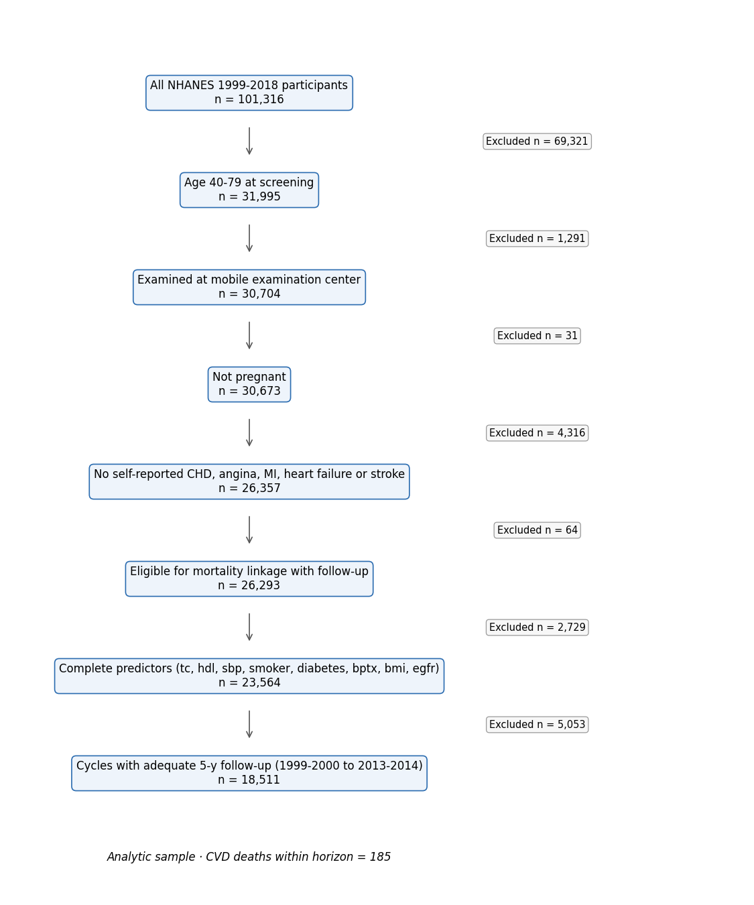
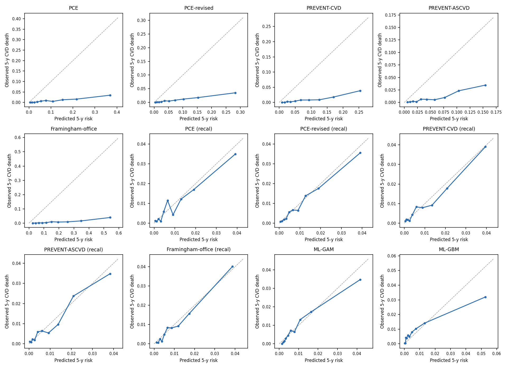
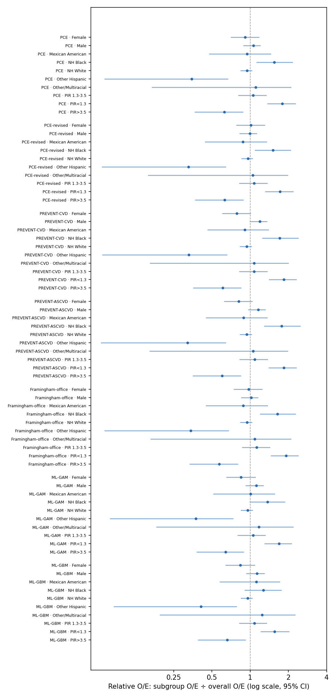

# EquiCVD Bench — run report (v1.0.0, scenario: horizon_5y)

Run 2026-09-29T23:51:13+00:00 · horizon 5 y · B=200 Rao–Wu survey bootstrap · seed 20261101

## 1. Evaluation cohort

- Cycles evaluated: 1999-2000, 2001-2002, 2003-2004, 2005-2006, 2007-2008, 2009-2010, 2011-2012, 2013-2014
- Cycles dropped (censoring survival G(5y) < 0.1): 2015-2016, 2017-2018
- Participants: 18,511; CVD deaths within horizon: 185

**Table 1.** Baseline characteristics (survey-weighted mean (SD) or %; n unweighted)

| Characteristic | Overall | NH White | NH Black | Mexican American | Other Hispanic | Other/Multiracial |
|---|---|---|---|---|---|---|
| Participants, n | 18,511 | 8,634 | 3,771 | 3,402 | 1,471 | 1,233 |
| CVD deaths within horizon, n | 185 | 82 | 59 | 29 | 6 | 9 |
| Age, y | 54.5 (10.2) | 55.1 (10.3) | 53.3 (9.8) | 51.5 (9.6) | 53.0 (9.8) | 52.9 (9.5) |
| Total cholesterol, mg/dL | 206.7 (41.6) | 207.5 (41.0) | 200.0 (41.2) | 205.6 (39.2) | 211.4 (52.1) | 204.2 (42.1) |
| HDL cholesterol, mg/dL | 54.1 (16.7) | 54.4 (16.8) | 56.9 (17.6) | 49.7 (14.3) | 49.9 (13.7) | 52.9 (16.0) |
| Systolic BP, mmHg | 125.4 (17.8) | 124.7 (17.3) | 130.3 (19.7) | 125.3 (18.0) | 125.4 (19.1) | 125.0 (18.1) |
| BMI, kg/m² | 28.9 (6.3) | 28.7 (6.3) | 30.6 (7.4) | 29.9 (5.6) | 29.0 (5.4) | 26.6 (5.6) |
| eGFR, mL/min/1.73m² | 90.4 (16.7) | 89.6 (16.1) | 84.8 (18.9) | 100.1 (15.8) | 95.8 (16.2) | 96.4 (15.8) |
| Female, % | 52.7 | 52.3 | 55.2 | 49.4 | 54.6 | 55.5 |
| Current smoking, % | 19.8 | 19.0 | 26.8 | 18.0 | 18.3 | 20.4 |
| Diabetes, % | 12.0 | 9.6 | 19.8 | 20.3 | 17.9 | 18.3 |
| BP-lowering medication, % | 26.7 | 26.4 | 38.8 | 18.8 | 21.6 | 21.9 |
| Lipid-lowering medication, % | 18.0 | 18.7 | 16.3 | 13.2 | 15.7 | 18.0 |
| Income-to-poverty ratio < 1.3, % | 15.8 | 11.2 | 27.1 | 38.4 | 34.2 | 20.5 |
| Less than high school, % | 17.0 | 11.1 | 26.0 | 56.1 | 39.1 | 20.2 |

## 2a. Overall performance, as published (outcome: 5-year CVD death, NHANES public-use LMF)

| Tool | Target | Expected % | Observed % | O/E | Cal. slope | AUC | Scaled Brier | % ≥7.5% | TPR@7.5% |
|---|---|---|---|---|---|---|---|---|---|
| PCE | hard ASCVD | 8.2 (8.0–8.4) | 0.7 (0.6–0.9) | 0.09 (0.07–0.10) | 0.85 (0.70–1.02) | 0.783 (0.745–0.823) | -1.918 (-2.539–-1.506) | 35.0 (33.9–36.1) | 74.9 (65.8–84.7) |
| PCE-revised | hard ASCVD | 5.8 (5.7–6.0) | 0.7 (0.6–0.9) | 0.12 (0.10–0.15) | 0.90 (0.75–1.08) | 0.791 (0.752–0.832) | -0.959 (-1.270–-0.731) | 24.7 (23.8–25.5) | 69.3 (59.7–79.1) |
| PREVENT-CVD | total CVD (ASCVD+HF) | 6.8 (6.7–7.0) | 0.7 (0.6–0.9) | 0.10 (0.08–0.13) | 1.19 (0.94–1.50) | 0.794 (0.747–0.844) | -0.985 (-1.336–-0.759) | 31.3 (30.2–32.2) | 73.9 (64.7–83.2) |
| PREVENT-ASCVD | ASCVD | 4.3 (4.2–4.3) | 0.7 (0.6–0.9) | 0.17 (0.13–0.20) | 1.26 (0.98–1.60) | 0.789 (0.741–0.838) | -0.303 (-0.432–-0.214) | 17.6 (16.9–18.3) | 61.5 (51.7–72.9) |
| Framingham-office | general CVD | 15.1 (14.8–15.5) | 0.7 (0.6–0.9) | 0.05 (0.04–0.06) | 0.93 (0.78–1.08) | 0.790 (0.753–0.826) | -5.293 (-6.833–-4.261) | 63.8 (62.7–65.0) | 93.4 (88.9–98.1) |
| ML-GAM | CVD death (trained here) | 0.8 (0.8–0.8) | 0.7 (0.6–0.9) | 0.91 (0.72–1.10) | 1.02 (0.86–1.19) | 0.796 (0.750–0.848) | 0.014 (0.002–0.025) | 0.5 (0.4–0.6) | 6.7 (2.8–10.0) |
| ML-GBM | CVD death (trained here) | 0.7 (0.7–0.7) | 0.7 (0.6–0.9) | 1.04 (0.83–1.25) | 0.65 (0.57–0.76) | 0.763 (0.722–0.805) | -0.011 (-0.030–0.003) | 1.1 (0.9–1.2) | 9.1 (5.2–13.2) |

## 2b. Overall performance after logistic recalibration to CVD death (5-fold cross-fitted)

Recalibration refits only an intercept and slope on each tool's logit, so ranking (AUC) is unchanged; it answers "how fair is the tool once its absolute level is corrected for this outcome?"

| Tool | Target | Expected % | Observed % | O/E | Cal. slope | AUC | Scaled Brier | % ≥7.5% | TPR@7.5% |
|---|---|---|---|---|---|---|---|---|---|
| PCE (recal) | hard ASCVD → recalibrated to CVD death | 0.8 (0.7–0.8) | 0.7 (0.6–0.9) | 0.93 (0.74–1.14) | 0.92 (0.77–1.12) | 0.781 (0.740–0.822) | 0.010 (0.002–0.016) | 0.3 (0.2–0.3) | 2.1 (0.7–3.4) |
| PCE-revised (recal) | hard ASCVD → recalibrated to CVD death | 0.8 (0.7–0.8) | 0.7 (0.6–0.9) | 0.92 (0.73–1.12) | 0.99 (0.82–1.20) | 0.789 (0.751–0.830) | 0.011 (0.002–0.018) | 0.3 (0.2–0.3) | 2.8 (0.3–5.4) |
| PREVENT-CVD (recal) | total CVD (ASCVD+HF) → recalibrated to CVD death | 0.7 (0.7–0.8) | 0.7 (0.6–0.9) | 0.95 (0.75–1.16) | 0.96 (0.75–1.22) | 0.794 (0.747–0.844) | 0.016 (0.006–0.025) | 0.2 (0.1–0.2) | 3.5 (0.6–6.1) |
| PREVENT-ASCVD (recal) | ASCVD → recalibrated to CVD death | 0.7 (0.7–0.8) | 0.7 (0.6–0.9) | 0.94 (0.74–1.15) | 0.95 (0.74–1.22) | 0.789 (0.739–0.839) | 0.015 (0.005–0.022) | 0.1 (0.1–0.2) | 3.3 (0.3–6.2) |
| Framingham-office (recal) | general CVD → recalibrated to CVD death | 0.8 (0.8–0.8) | 0.7 (0.6–0.9) | 0.91 (0.72–1.11) | 1.05 (0.89–1.22) | 0.789 (0.750–0.826) | 0.010 (0.001–0.017) | 0.3 (0.3–0.4) | 2.7 (1.2–4.6) |

## 3. Subgroup calibration: relative O/E (subgroup O/E ÷ overall O/E; 1 = same as overall)

**sex**

| Tool | Female | Male |
|---|---|---|
| PCE | 0.91 (0.70–1.18) | 1.06 (0.88–1.21) |
| PCE-revised | 1.01 (0.78–1.31) | 0.99 (0.82–1.13) |
| PREVENT-CVD | 0.78 (0.60–1.01) | 1.19 (0.99–1.36) |
| PREVENT-ASCVD | 0.81 (0.62–1.05) | 1.16 (0.96–1.32) |
| Framingham-office | 0.97 (0.74–1.25) | 1.02 (0.85–1.16) |
| PCE (recal) | 0.91 (0.70–1.17) | 1.06 (0.88–1.21) |
| PCE-revised (recal) | 1.00 (0.77–1.30) | 1.00 (0.83–1.14) |
| PREVENT-CVD (recal) | 0.80 (0.61–1.03) | 1.18 (0.97–1.35) |
| PREVENT-ASCVD (recal) | 0.84 (0.64–1.08) | 1.13 (0.93–1.29) |
| Framingham-office (recal) | 1.02 (0.78–1.31) | 0.99 (0.82–1.12) |
| ML-GAM | 0.85 (0.65–1.10) | 1.12 (0.92–1.28) |
| ML-GBM | 0.83 (0.64–1.09) | 1.13 (0.93–1.30) |
| *events* | 73 | 112 |

**race**

| Tool | Mexican American | NH Black | NH White | Other Hispanic | Other/Multiracial |
|---|---|---|---|---|---|
| PCE | 0.94 (0.47–1.46) | 1.54 (1.12–2.16) | 0.95 (0.83–1.04) | 0.35 (0.07–0.67) | 1.10 (0.17–2.10) |
| PCE-revised | 0.88 (0.44–1.35) | 1.51 (1.09–2.09) | 0.96 (0.85–1.05) | 0.33 (0.07–0.65) | 1.05 (0.16–1.99) |
| PREVENT-CVD | 0.91 (0.46–1.40) | 1.71 (1.24–2.40) | 0.94 (0.83–1.03) | 0.33 (0.07–0.66) | 1.07 (0.16–2.01) |
| PREVENT-ASCVD | 0.88 (0.45–1.37) | 1.77 (1.28–2.49) | 0.94 (0.83–1.03) | 0.32 (0.07–0.64) | 1.06 (0.16–1.98) |
| Framingham-office | 0.88 (0.45–1.38) | 1.63 (1.19–2.28) | 0.94 (0.83–1.03) | 0.34 (0.07–0.68) | 1.08 (0.16–2.10) |
| PCE (recal) | 0.94 (0.47–1.46) | 1.53 (1.10–2.14) | 0.95 (0.83–1.04) | 0.35 (0.07–0.69) | 1.11 (0.17–2.13) |
| PCE-revised (recal) | 0.87 (0.44–1.34) | 1.52 (1.09–2.10) | 0.96 (0.85–1.05) | 0.33 (0.07–0.64) | 1.05 (0.16–1.99) |
| PREVENT-CVD (recal) | 0.90 (0.46–1.39) | 1.59 (1.14–2.21) | 0.95 (0.83–1.04) | 0.33 (0.07–0.67) | 1.10 (0.17–2.07) |
| PREVENT-ASCVD (recal) | 0.88 (0.45–1.36) | 1.69 (1.21–2.36) | 0.94 (0.83–1.03) | 0.32 (0.07–0.65) | 1.08 (0.17–2.03) |
| Framingham-office (recal) | 0.88 (0.45–1.37) | 1.53 (1.13–2.15) | 0.95 (0.84–1.04) | 0.34 (0.07–0.67) | 1.13 (0.17–2.17) |
| ML-GAM | 1.01 (0.51–1.57) | 1.37 (0.99–1.88) | 0.95 (0.84–1.05) | 0.37 (0.08–0.73) | 1.17 (0.18–2.20) |
| ML-GBM | 1.12 (0.57–1.72) | 1.27 (0.90–1.76) | 0.95 (0.84–1.04) | 0.41 (0.08–0.79) | 1.24 (0.19–2.27) |
| *events* | 29 | 59 | 82 | 6 | 9 |

**age_group**

| Tool | 40-49 | 50-59 | 60-69 | 70-79 |
|---|---|---|---|---|
| PCE | 1.04 (0.50–1.55) | 1.03 (0.66–1.39) | 0.95 (0.68–1.24) | 1.01 (0.76–1.31) |
| PCE-revised | 0.95 (0.46–1.42) | 0.93 (0.60–1.26) | 0.92 (0.66–1.22) | 1.16 (0.88–1.52) |
| PREVENT-CVD | 0.97 (0.47–1.46) | 0.94 (0.60–1.27) | 0.92 (0.66–1.20) | 1.15 (0.86–1.48) |
| PREVENT-ASCVD | 0.90 (0.44–1.36) | 0.91 (0.59–1.22) | 0.93 (0.67–1.22) | 1.20 (0.90–1.55) |
| Framingham-office | 0.78 (0.38–1.16) | 0.81 (0.52–1.10) | 0.94 (0.67–1.23) | 1.49 (1.12–1.93) |
| PCE (recal) | 1.08 (0.52–1.62) | 1.08 (0.70–1.46) | 0.98 (0.71–1.29) | 0.94 (0.71–1.22) |
| PCE-revised (recal) | 0.94 (0.45–1.41) | 0.93 (0.60–1.26) | 0.94 (0.67–1.24) | 1.14 (0.86–1.50) |
| PREVENT-CVD (recal) | 1.39 (0.66–2.09) | 1.13 (0.74–1.53) | 0.91 (0.64–1.18) | 0.90 (0.68–1.17) |
| PREVENT-ASCVD (recal) | 1.29 (0.61–1.94) | 1.07 (0.70–1.44) | 0.90 (0.64–1.18) | 0.95 (0.72–1.24) |
| Framingham-office (recal) | 0.88 (0.43–1.31) | 0.89 (0.57–1.20) | 0.92 (0.66–1.21) | 1.27 (0.96–1.65) |
| ML-GAM | 0.75 (0.37–1.11) | 1.03 (0.65–1.41) | 1.17 (0.84–1.55) | 0.99 (0.75–1.28) |
| ML-GBM | 1.03 (0.49–1.53) | 1.15 (0.73–1.59) | 1.04 (0.74–1.38) | 0.88 (0.65–1.16) |
| *events* | 20 | 32 | 47 | 86 |

**income**

| Tool | PIR 1.3-3.5 | PIR<1.3 | PIR>3.5 |
|---|---|---|---|
| PCE | 1.06 (0.80–1.34) | 1.79 (1.36–2.28) | 0.63 (0.37–0.88) |
| PCE-revised | 1.08 (0.82–1.37) | 1.72 (1.30–2.19) | 0.63 (0.37–0.88) |
| PREVENT-CVD | 1.08 (0.82–1.37) | 1.84 (1.40–2.32) | 0.61 (0.35–0.85) |
| PREVENT-ASCVD | 1.08 (0.82–1.38) | 1.84 (1.39–2.32) | 0.60 (0.35–0.84) |
| Framingham-office | 1.13 (0.86–1.43) | 1.91 (1.45–2.41) | 0.57 (0.33–0.80) |
| PCE (recal) | 1.05 (0.79–1.33) | 1.76 (1.33–2.25) | 0.64 (0.37–0.89) |
| PCE-revised (recal) | 1.08 (0.82–1.37) | 1.69 (1.28–2.15) | 0.63 (0.37–0.89) |
| PREVENT-CVD (recal) | 1.03 (0.78–1.29) | 1.72 (1.33–2.18) | 0.66 (0.39–0.92) |
| PREVENT-ASCVD (recal) | 1.04 (0.79–1.31) | 1.72 (1.32–2.18) | 0.65 (0.38–0.91) |
| Framingham-office (recal) | 1.11 (0.84–1.40) | 1.85 (1.39–2.33) | 0.59 (0.34–0.83) |
| ML-GAM | 1.06 (0.80–1.32) | 1.68 (1.29–2.13) | 0.64 (0.38–0.89) |
| ML-GBM | 1.08 (0.82–1.36) | 1.56 (1.20–2.04) | 0.66 (0.39–0.92) |
| *events* | 68 | 78 | 24 |

**education**

| Tool | <HS | College+ | HS/GED | Some college |
|---|---|---|---|---|
| PCE | 1.37 (1.03–1.71) | 0.74 (0.38–1.13) | 0.84 (0.49–1.10) | 1.04 (0.64–1.39) |
| PCE-revised | 1.33 (1.00–1.66) | 0.78 (0.39–1.19) | 0.83 (0.48–1.10) | 1.03 (0.63–1.37) |
| PREVENT-CVD | 1.44 (1.08–1.80) | 0.71 (0.36–1.09) | 0.86 (0.50–1.11) | 1.02 (0.62–1.36) |
| PREVENT-ASCVD | 1.44 (1.08–1.80) | 0.71 (0.36–1.09) | 0.86 (0.50–1.11) | 1.01 (0.62–1.35) |
| Framingham-office | 1.49 (1.12–1.87) | 0.69 (0.35–1.06) | 0.87 (0.50–1.14) | 1.00 (0.61–1.33) |
| PCE (recal) | 1.34 (1.01–1.67) | 0.75 (0.38–1.14) | 0.84 (0.48–1.10) | 1.05 (0.65–1.41) |
| PCE-revised (recal) | 1.32 (0.99–1.64) | 0.78 (0.40–1.20) | 0.83 (0.47–1.09) | 1.04 (0.63–1.39) |
| PREVENT-CVD (recal) | 1.31 (0.99–1.65) | 0.77 (0.39–1.16) | 0.84 (0.49–1.09) | 1.05 (0.64–1.41) |
| PREVENT-ASCVD (recal) | 1.32 (1.00–1.66) | 0.77 (0.39–1.17) | 0.84 (0.49–1.09) | 1.04 (0.64–1.39) |
| Framingham-office (recal) | 1.41 (1.07–1.77) | 0.72 (0.36–1.09) | 0.85 (0.49–1.10) | 1.03 (0.63–1.37) |
| ML-GAM | 1.35 (1.02–1.69) | 0.76 (0.39–1.14) | 0.84 (0.48–1.10) | 1.04 (0.63–1.41) |
| ML-GBM | 1.31 (0.97–1.65) | 0.79 (0.40–1.18) | 0.79 (0.45–1.06) | 1.10 (0.65–1.49) |
| *events* | 86 | 22 | 38 | 37 |

## 4. Fairness gaps across subgroups (95% basic bootstrap CI)

Subgroups with < 10 horizon events are excluded from gap summaries.

| Tool | Attribute | O/E max÷min | AUC max−min | TPR@7.5% max−min | FPR@7.5% max−min |
|---|---|---|---|---|---|
| PCE | sex | 1.16 (1.00–1.31) | 0.032 (0.000–0.063) | 11.0 (0.0–20.9) | 20.9 (19.6–22.4) |
| PCE | race | 1.64 (1.00–2.05) | 0.036 (0.000–0.065) | 12.5 (0.0–23.2) | 16.9 (14.2–22.9) |
| PCE | age_group | 1.10 (1.00–1.10) | 0.156 (0.024–0.281) | 78.6 (67.0–130.0) | 90.8 (89.9–109.9) |
| PCE | income | 2.85 (1.65–4.39) | 0.032 (0.000–0.050) | 9.0 (0.0–15.5) | 14.7 (12.7–29.1) |
| PCE | education | 1.84 (1.00–2.43) | 0.049 (0.000–0.071) | 25.6 (0.0–35.0) | 21.9 (19.4–30.5) |
| PCE-revised | sex | 1.02 (1.00–1.03) | 0.046 (0.000–0.088) | 20.5 (0.8–39.8) | 19.8 (18.6–21.2) |
| PCE-revised | race | 1.72 (1.00–2.28) | 0.073 (0.000–0.124) | 13.3 (0.0–24.3) | 10.5 (8.3–13.0) |
| PCE-revised | age_group | 1.26 (1.00–1.41) | 0.161 (0.028–0.292) | 66.1 (45.1–93.4) | 75.0 (73.4–89.5) |
| PCE-revised | income | 2.73 (1.58–4.24) | 0.009 (0.000–0.014) | 4.7 (0.0–7.4) | 12.3 (10.5–24.5) |
| PCE-revised | education | 1.71 (1.00–2.22) | 0.048 (0.000–0.078) | 24.5 (0.0–38.2) | 20.0 (18.1–26.9) |
| PREVENT-CVD | sex | 1.52 (1.00–2.02) | 0.050 (0.000–0.097) | 2.3 (0.0–4.2) | 7.1 (5.6–8.8) |
| PREVENT-CVD | race | 1.89 (1.00–2.42) | 0.061 (0.000–0.109) | 9.8 (0.0–17.4) | 7.1 (4.7–11.9) |
| PREVENT-CVD | age_group | 1.25 (1.00–1.40) | 0.159 (0.002–0.277) | 68.6 (50.9–108.5) | 94.9 (94.3–110.6) |
| PREVENT-CVD | income | 3.03 (1.79–4.73) | 0.031 (0.000–0.052) | 20.6 (0.0–39.1) | 14.4 (12.5–28.2) |
| PREVENT-CVD | education | 2.02 (1.00–2.80) | 0.103 (0.000–0.167) | 25.9 (0.0–38.0) | 19.2 (17.2–26.4) |
| PREVENT-ASCVD | sex | 1.43 (1.00–1.82) | 0.055 (0.000–0.106) | 5.6 (0.0–10.4) | 5.8 (4.9–7.0) |
| PREVENT-ASCVD | race | 2.00 (1.00–2.60) | 0.065 (0.000–0.114) | 13.4 (0.0–23.8) | 3.8 (1.9–6.1) |
| PREVENT-ASCVD | age_group | 1.33 (1.00–1.55) | 0.146 (0.000–0.269) | 87.6 (76.8–130.5) | 82.9 (81.6–88.9) |
| PREVENT-ASCVD | income | 3.05 (1.81–4.78) | 0.031 (0.000–0.050) | 5.8 (0.0–8.7) | 11.4 (9.8–22.4) |
| PREVENT-ASCVD | education | 2.03 (1.00–2.81) | 0.109 (0.000–0.181) | 29.1 (0.5–42.1) | 15.8 (14.1–20.8) |
| Framingham-office | sex | 1.05 (1.00–1.08) | 0.009 (0.000–0.014) | 12.7 (0.0–23.6) | 34.3 (32.6–35.9) |
| Framingham-office | race | 1.86 (1.00–2.41) | 0.130 (0.002–0.238) | 21.6 (0.5–41.7) | 13.0 (10.2–20.4) |
| Framingham-office | age_group | 1.91 (1.00–2.51) | 0.164 (0.028–0.299) | 18.1 (0.0–31.5) | 65.1 (63.9–103.9) |
| Framingham-office | income | 3.35 (1.94–5.38) | 0.019 (0.000–0.033) | 12.4 (0.0–24.5) | 10.6 (8.7–20.7) |
| Framingham-office | education | 2.16 (1.00–3.05) | 0.038 (0.000–0.059) | 19.9 (1.4–34.5) | 18.9 (16.7–29.0) |
| PCE (recal) | sex | 1.17 (1.00–1.32) | 0.032 (0.000–0.062) | 1.1 (0.0–2.2) | 0.2 (0.0–0.3) |
| PCE (recal) | race | 1.63 (1.00–2.04) | 0.033 (0.000–0.058) | 6.6 (1.3–11.6) | 0.1 (0.0–0.2) |
| PCE (recal) | age_group | 1.15 (1.00–1.22) | 0.143 (0.010–0.258) | 5.4 (1.4–9.2) | 2.0 (1.5–2.6) |
| PCE (recal) | income | 2.76 (1.57–4.23) | 0.034 (0.000–0.052) | 3.1 (0.0–6.0) | 0.4 (0.1–0.8) |
| PCE (recal) | education | 1.77 (1.00–2.31) | 0.058 (0.000–0.097) | 2.7 (0.0–4.4) | 0.4 (0.3–0.7) |
| PCE-revised (recal) | sex | 1.00 (1.00–1.00) | 0.046 (0.000–0.089) | 0.7 (0.0–1.2) | 0.1 (0.0–0.3) |
| PCE-revised (recal) | race | 1.74 (1.00–2.30) | 0.072 (0.000–0.121) | 2.5 (0.0–4.5) | 0.0 (0.0–0.1) |
| PCE-revised (recal) | age_group | 1.23 (1.00–1.38) | 0.151 (0.013–0.270) | 5.4 (0.0–9.5) | 1.3 (1.0–1.9) |
| PCE-revised (recal) | income | 2.67 (1.50–4.13) | 0.006 (0.000–0.006) | 1.7 (0.0–3.0) | 0.5 (0.2–0.8) |
| PCE-revised (recal) | education | 1.68 (1.00–2.15) | 0.055 (0.000–0.092) | 6.9 (1.6–12.8) | 0.5 (0.3–0.8) |
| PREVENT-CVD (recal) | sex | 1.48 (1.00–1.91) | 0.050 (0.000–0.097) | 0.7 (0.0–1.1) | 0.1 (0.0–0.1) |
| PREVENT-CVD (recal) | race | 1.76 (1.00–2.28) | 0.060 (0.000–0.105) | 4.3 (0.0–7.7) | 0.5 (0.2–0.7) |
| PREVENT-CVD (recal) | age_group | 1.54 (1.00–1.95) | 0.153 (0.000–0.264) | 5.0 (0.0–8.3) | 1.0 (0.7–1.4) |
| PREVENT-CVD (recal) | income | 2.62 (1.53–3.91) | 0.033 (0.000–0.059) | 6.5 (0.1–11.5) | 0.3 (0.1–0.5) |
| PREVENT-CVD (recal) | education | 1.71 (1.00–2.19) | 0.107 (0.000–0.173) | 7.1 (0.0–12.5) | 0.3 (0.2–0.5) |
| PREVENT-ASCVD (recal) | sex | 1.35 (1.00–1.67) | 0.056 (0.000–0.108) | 0.8 (0.0–1.4) | 0.2 (0.1–0.3) |
| PREVENT-ASCVD (recal) | race | 1.92 (1.00–2.52) | 0.064 (0.000–0.115) | 1.6 (0.0–2.9) | 0.2 (0.0–0.3) |
| PREVENT-ASCVD (recal) | age_group | 1.43 (1.00–1.69) | 0.140 (0.000–0.253) | 5.2 (0.0–9.9) | 0.5 (0.3–0.7) |
| PREVENT-ASCVD (recal) | income | 2.64 (1.51–3.98) | 0.033 (0.000–0.057) | 5.8 (0.0–11.0) | 0.4 (0.0–0.6) |
| PREVENT-ASCVD (recal) | education | 1.71 (1.00–2.22) | 0.114 (0.000–0.190) | 7.1 (0.0–13.2) | 0.2 (0.0–0.4) |
| Framingham-office (recal) | sex | 1.04 (1.00–1.07) | 0.008 (0.000–0.012) | 0.1 (0.0–0.1) | 0.4 (0.3–0.6) |
| Framingham-office (recal) | race | 1.74 (1.00–2.29) | 0.130 (0.008–0.237) | 7.1 (0.7–12.0) | 0.4 (0.1–0.6) |
| Framingham-office (recal) | age_group | 1.44 (1.00–1.70) | 0.155 (0.019–0.279) | 7.1 (2.3–11.5) | 2.1 (1.6–2.8) |
| Framingham-office (recal) | income | 3.15 (1.87–5.00) | 0.016 (0.000–0.028) | 4.8 (0.4–9.2) | 0.2 (0.0–0.4) |
| Framingham-office (recal) | education | 1.97 (1.00–2.68) | 0.041 (0.000–0.060) | 6.4 (1.1–10.7) | 0.4 (0.1–0.5) |
| ML-GAM | sex | 1.32 (1.00–1.63) | 0.081 (0.004–0.158) | 1.4 (0.0–2.6) | 0.3 (0.1–0.4) |
| ML-GAM | race | 1.43 (1.00–1.77) | 0.047 (0.000–0.083) | 9.0 (1.7–15.0) | 1.0 (0.6–1.3) |
| ML-GAM | age_group | 1.57 (1.00–2.04) | 0.134 (0.036–0.247) | 15.1 (5.1–22.8) | 4.0 (3.2–4.7) |
| ML-GAM | income | 2.63 (1.58–4.01) | 0.014 (0.000–0.022) | 7.2 (0.0–13.8) | 0.8 (0.5–1.5) |
| ML-GAM | education | 1.78 (1.00–2.30) | 0.061 (0.000–0.097) | 12.5 (0.7–21.0) | 0.9 (0.7–1.3) |
| ML-GBM | sex | 1.36 (1.00–1.69) | 0.023 (0.000–0.044) | 1.2 (0.0–2.1) | 0.6 (0.3–0.8) |
| ML-GBM | race | 1.33 (1.00–1.57) | 0.043 (0.000–0.071) | 7.1 (0.0–12.0) | 1.4 (0.9–1.9) |
| ML-GBM | age_group | 1.30 (1.00–1.44) | 0.072 (0.000–0.119) | 21.9 (12.0–32.3) | 5.9 (4.9–6.9) |
| ML-GBM | income | 2.36 (1.25–3.60) | 0.082 (0.000–0.145) | 3.4 (0.0–5.7) | 1.3 (0.9–2.3) |
| ML-GBM | education | 1.67 (1.00–2.08) | 0.074 (0.000–0.118) | 13.6 (0.0–22.0) | 1.4 (1.0–1.9) |

## 5. Explainability (ML-GBM, out-of-fold permutation importance, drop in AUC)

| Feature | ΔAUC (mean ± SD across folds) |
|---|---|
| age | 0.0802 ± 0.0237 |
| egfr | 0.0361 ± 0.0149 |
| smoker | 0.0311 ± 0.0179 |
| tc | 0.0144 ± 0.0098 |
| bptx | 0.0141 ± 0.0067 |
| female | 0.0116 ± 0.0096 |
| hdl | 0.0106 ± 0.0067 |
| sbp | 0.0105 ± 0.0128 |
| diabetes | 0.0074 ± 0.0083 |
| bmi | 0.0059 ± 0.0148 |
| statin | -0.0014 ± 0.0040 |

ML-GAM partial log-odds shape functions: `ml_gam_shape_functions.csv`.

## 6. Interpretation notes and known limitations

- **Outcome mismatch.** Public-use LMF supports CVD *mortality* (UCOD 001 heart disease, 005 cerebrovascular), not incident ASCVD. O/E < 1 for as-published PCE/PREVENT is expected by construction; subgroup *relative* O/E, the recalibrated results, and the gap metrics are the fairness-relevant quantities. ML comparators are trained on this outcome and so bound what is achievable here.
- **Competing risks.** Non-CVD deaths before the horizon are known non-events (cumulative-incidence estimand).
- **Censoring.** IPCW with Kaplan–Meier censoring estimated within cycle.
- **What the CIs cover.** IPCW weights, recalibration fits and ML fits are held fixed across bootstrap replicates, so CIs reflect sampling of participants/PSUs but not model-fitting variability. Cross-fitting (5 folds) removes in-sample optimism from the point estimates.
- **Gap CIs** use basic (reflected) bootstrap intervals because max/min statistics are biased upward under resampling; all other CIs are percentile intervals.
- **Age-group threshold gaps** (TPR/FPR) mostly reflect that age is a dominant predictor, not unfairness.
- **Predictors.** Lipid-lowering medication (BPQ100D) proxies statin use; eGFR is CKD-EPI 2021 on standardized creatinine; out-of-range inputs are clipped to each equation's valid range unless excluded.
- **Public-use perturbation.** NCHS perturbs some follow-up/cause fields in public-use LMF; results should be confirmed against restricted-use files before clinical interpretation.

## Figures

