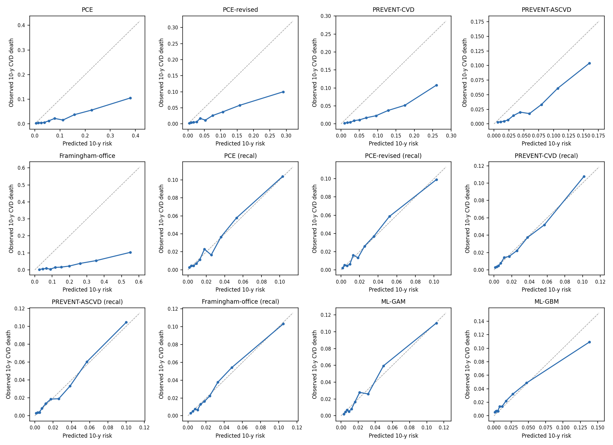
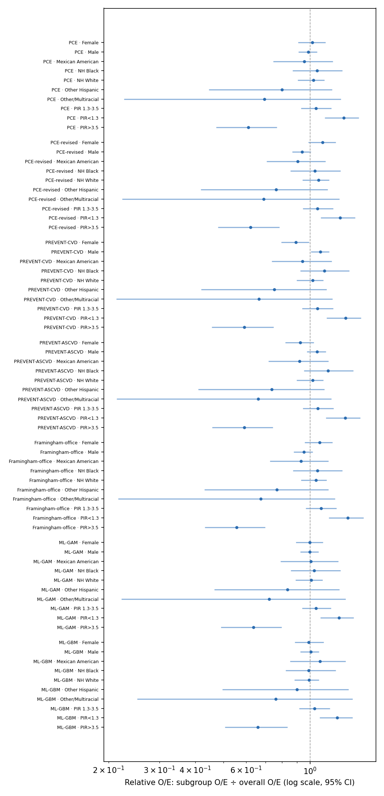

# EquiCVD Bench — run report (v1.0.0rc1, scenario: unweighted)

Run 2026-09-29T17:08:21+00:00 · horizon 10 y · B=200 iid bootstrap (unweighted) · seed 20261101

## 1. Evaluation cohort

- Cycles evaluated: 1999-2000, 2001-2002, 2003-2004, 2005-2006, 2007-2008, 2009-2010
- Cycles dropped (censoring survival G(10y) < 0.1): 2011-2012, 2013-2014, 2015-2016, 2017-2018
- Participants: 13,466; CVD deaths within horizon: 362

**Table 1.** Baseline characteristics (unweighted mean (SD) or %; n unweighted)

| Characteristic | Overall | NH White | NH Black | Mexican American | Other Hispanic | Other/Multiracial |
|---|---|---|---|---|---|---|
| Participants, n | 13,466 | 6,689 | 2,577 | 2,794 | 929 | 477 |
| CVD deaths within horizon, n | 362 | 191 | 85 | 62 | 17 | 7 |
| Age, y | 56.6 (11.0) | 57.5 (11.3) | 55.8 (10.6) | 55.6 (10.8) | 55.7 (10.3) | 54.8 (10.3) |
| Total cholesterol, mg/dL | 207.7 (41.1) | 209.0 (41.1) | 202.3 (40.7) | 209.1 (39.5) | 210.1 (45.0) | 205.9 (42.9) |
| HDL cholesterol, mg/dL | 53.4 (16.4) | 53.9 (16.7) | 57.1 (17.7) | 49.9 (14.4) | 50.3 (13.7) | 53.4 (15.8) |
| Systolic BP, mmHg | 128.4 (19.5) | 126.8 (18.5) | 132.3 (20.7) | 129.6 (20.3) | 126.3 (19.8) | 127.7 (19.2) |
| BMI, kg/m² | 29.1 (6.2) | 28.6 (6.2) | 30.1 (7.1) | 29.5 (5.3) | 29.3 (5.5) | 26.7 (5.5) |
| eGFR, mL/min/1.73m² | 89.3 (17.8) | 87.7 (16.7) | 83.0 (19.0) | 96.4 (16.6) | 94.5 (16.7) | 94.4 (17.3) |
| Female, % | 51.1 | 50.6 | 50.3 | 51.4 | 54.3 | 54.9 |
| Current smoking, % | 20.7 | 20.1 | 27.2 | 17.4 | 17.2 | 21.8 |
| Diabetes, % | 16.1 | 10.4 | 21.5 | 22.7 | 20.6 | 18.2 |
| BP-lowering medication, % | 29.5 | 28.6 | 41.2 | 22.6 | 26.3 | 26.2 |
| Lipid-lowering medication, % | 17.4 | 18.9 | 16.3 | 14.4 | 18.7 | 17.6 |
| Income-to-poverty ratio < 1.3, % | 25.4 | 17.5 | 25.9 | 39.2 | 37.5 | 33.6 |
| Less than high school, % | 30.6 | 15.1 | 31.9 | 62.8 | 45.6 | 24.3 |

## 2a. Overall performance, as published (outcome: 10-year CVD death, NHANES public-use LMF)

| Tool | Target | Expected % | Observed % | O/E | Cal. slope | AUC | Scaled Brier | % ≥7.5% | TPR@7.5% |
|---|---|---|---|---|---|---|---|---|---|
| PCE | hard ASCVD | 10.9 (10.7–11.1) | 2.7 (2.5–3.0) | 0.25 (0.23–0.27) | 0.91 (0.82–1.02) | 0.789 (0.769–0.811) | -0.492 (-0.590–-0.381) | 46.2 (45.4–47.1) | 87.0 (83.5–90.3) |
| PCE-revised | hard ASCVD | 7.8 (7.7–7.9) | 2.7 (2.5–3.0) | 0.35 (0.32–0.38) | 0.90 (0.81–1.01) | 0.786 (0.765–0.806) | -0.193 (-0.248–-0.130) | 35.0 (34.3–35.8) | 77.9 (73.8–82.3) |
| PREVENT-CVD | total CVD (ASCVD+HF) | 8.7 (8.5–8.8) | 2.7 (2.5–3.0) | 0.31 (0.28–0.34) | 1.19 (1.07–1.33) | 0.794 (0.773–0.816) | -0.180 (-0.235–-0.129) | 42.2 (41.3–42.9) | 84.5 (81.0–87.9) |
| PREVENT-ASCVD | ASCVD | 5.4 (5.3–5.5) | 2.7 (2.5–3.0) | 0.50 (0.46–0.55) | 1.28 (1.14–1.43) | 0.792 (0.772–0.812) | 0.000 (-0.019–0.022) | 27.0 (26.2–27.6) | 71.6 (67.4–76.3) |
| Framingham-office | general CVD | 18.6 (18.3–18.8) | 2.7 (2.5–3.0) | 0.15 (0.13–0.16) | 0.91 (0.82–1.00) | 0.781 (0.759–0.803) | -1.562 (-1.809–-1.306) | 71.1 (70.2–71.8) | 94.4 (92.0–96.5) |
| ML-GAM | CVD death (trained here) | 2.7 (2.6–2.7) | 2.7 (2.5–3.0) | 1.01 (0.90–1.11) | 1.02 (0.94–1.12) | 0.799 (0.779–0.822) | 0.043 (0.030–0.058) | 7.5 (7.1–7.9) | 35.0 (30.8–40.2) |
| ML-GBM | CVD death (trained here) | 2.6 (2.6–2.7) | 2.7 (2.5–3.0) | 1.02 (0.92–1.14) | 0.72 (0.65–0.81) | 0.774 (0.750–0.798) | 0.022 (0.001–0.049) | 8.2 (7.8–8.8) | 36.6 (32.3–41.6) |

## 2b. Overall performance after logistic recalibration to CVD death (5-fold cross-fitted)

Recalibration refits only an intercept and slope on each tool's logit, so ranking (AUC) is unchanged; it answers "how fair is the tool once its absolute level is corrected for this outcome?"

| Tool | Target | Expected % | Observed % | O/E | Cal. slope | AUC | Scaled Brier | % ≥7.5% | TPR@7.5% |
|---|---|---|---|---|---|---|---|---|---|
| PCE (recal) | hard ASCVD → recalibrated to CVD death | 2.7 (2.6–2.7) | 2.7 (2.5–3.0) | 1.01 (0.92–1.11) | 0.99 (0.89–1.11) | 0.788 (0.767–0.810) | 0.039 (0.027–0.050) | 7.4 (7.0–7.8) | 32.7 (28.0–37.8) |
| PCE-revised (recal) | hard ASCVD → recalibrated to CVD death | 2.7 (2.6–2.7) | 2.7 (2.5–3.0) | 1.00 (0.91–1.11) | 0.99 (0.89–1.12) | 0.785 (0.764–0.806) | 0.035 (0.024–0.047) | 7.5 (7.1–7.9) | 29.4 (25.1–35.4) |
| PREVENT-CVD (recal) | total CVD (ASCVD+HF) → recalibrated to CVD death | 2.7 (2.6–2.7) | 2.7 (2.5–3.0) | 1.01 (0.91–1.11) | 0.99 (0.89–1.11) | 0.792 (0.772–0.815) | 0.040 (0.030–0.051) | 8.5 (8.1–9.0) | 36.0 (31.4–40.2) |
| PREVENT-ASCVD (recal) | ASCVD → recalibrated to CVD death | 2.7 (2.6–2.7) | 2.7 (2.5–3.0) | 1.01 (0.92–1.12) | 0.99 (0.89–1.10) | 0.791 (0.771–0.811) | 0.039 (0.029–0.048) | 8.3 (7.9–8.8) | 34.8 (30.4–39.2) |
| Framingham-office (recal) | general CVD → recalibrated to CVD death | 2.7 (2.6–2.7) | 2.7 (2.5–3.0) | 1.00 (0.91–1.11) | 0.99 (0.90–1.10) | 0.780 (0.758–0.803) | 0.034 (0.021–0.049) | 6.7 (6.3–7.1) | 28.9 (25.4–33.1) |

## 3. Subgroup calibration: relative O/E (subgroup O/E ÷ overall O/E; 1 = same as overall)

**sex**

| Tool | Female | Male |
|---|---|---|
| PCE | 1.02 (0.91–1.13) | 0.99 (0.91–1.06) |
| PCE-revised | 1.10 (0.99–1.23) | 0.94 (0.87–1.01) |
| PREVENT-CVD | 0.89 (0.79–0.99) | 1.09 (1.01–1.16) |
| PREVENT-ASCVD | 0.92 (0.82–1.03) | 1.06 (0.98–1.13) |
| Framingham-office | 1.08 (0.96–1.20) | 0.95 (0.88–1.02) |
| PCE (recal) | 1.02 (0.91–1.13) | 0.99 (0.91–1.06) |
| PCE-revised (recal) | 1.10 (0.98–1.22) | 0.94 (0.87–1.01) |
| PREVENT-CVD (recal) | 0.91 (0.81–1.01) | 1.07 (0.99–1.14) |
| PREVENT-ASCVD (recal) | 0.96 (0.86–1.06) | 1.03 (0.95–1.10) |
| Framingham-office (recal) | 1.15 (1.02–1.28) | 0.92 (0.85–0.99) |
| ML-GAM | 1.00 (0.89–1.11) | 1.00 (0.93–1.07) |
| ML-GBM | 0.99 (0.89–1.11) | 1.01 (0.93–1.07) |
| *events* | 145 | 217 |

**race**

| Tool | Mexican American | NH Black | NH White | Other Hispanic | Other/Multiracial |
|---|---|---|---|---|---|
| PCE | 0.96 (0.75–1.20) | 1.06 (0.87–1.29) | 1.03 (0.91–1.12) | 0.80 (0.45–1.19) | 0.69 (0.23–1.28) |
| PCE-revised | 0.91 (0.71–1.13) | 1.04 (0.86–1.28) | 1.07 (0.94–1.17) | 0.76 (0.42–1.15) | 0.69 (0.22–1.27) |
| PREVENT-CVD | 0.94 (0.74–1.19) | 1.12 (0.92–1.37) | 1.02 (0.90–1.11) | 0.75 (0.42–1.14) | 0.66 (0.21–1.20) |
| PREVENT-ASCVD | 0.92 (0.72–1.16) | 1.16 (0.95–1.41) | 1.02 (0.90–1.11) | 0.74 (0.41–1.12) | 0.66 (0.21–1.19) |
| Framingham-office | 0.93 (0.73–1.16) | 1.06 (0.87–1.30) | 1.05 (0.93–1.14) | 0.77 (0.43–1.16) | 0.67 (0.22–1.22) |
| PCE (recal) | 0.95 (0.74–1.19) | 1.06 (0.87–1.30) | 1.03 (0.91–1.12) | 0.80 (0.45–1.19) | 0.70 (0.23–1.30) |
| PCE-revised (recal) | 0.91 (0.71–1.13) | 1.04 (0.86–1.28) | 1.07 (0.94–1.17) | 0.75 (0.41–1.14) | 0.69 (0.22–1.27) |
| PREVENT-CVD (recal) | 0.94 (0.74–1.19) | 1.09 (0.90–1.33) | 1.03 (0.91–1.13) | 0.76 (0.43–1.14) | 0.69 (0.22–1.27) |
| PREVENT-ASCVD (recal) | 0.91 (0.71–1.15) | 1.13 (0.94–1.39) | 1.03 (0.91–1.12) | 0.74 (0.41–1.11) | 0.69 (0.23–1.26) |
| Framingham-office (recal) | 0.93 (0.73–1.16) | 1.01 (0.84–1.25) | 1.07 (0.95–1.17) | 0.77 (0.43–1.15) | 0.72 (0.23–1.31) |
| ML-GAM | 1.01 (0.79–1.25) | 1.03 (0.86–1.27) | 1.01 (0.89–1.10) | 0.83 (0.47–1.26) | 0.72 (0.22–1.33) |
| ML-GBM | 1.08 (0.85–1.33) | 0.99 (0.82–1.23) | 0.99 (0.88–1.07) | 0.90 (0.50–1.36) | 0.76 (0.25–1.40) |
| *events* | 62 | 85 | 191 | 17 | 7 |

**age_group**

| Tool | 40-49 | 50-59 | 60-69 | 70-79 |
|---|---|---|---|---|
| PCE | 0.99 (0.72–1.29) | 0.81 (0.62–1.07) | 0.85 (0.71–0.99) | 1.17 (1.05–1.28) |
| PCE-revised | 0.92 (0.66–1.20) | 0.74 (0.56–0.98) | 0.81 (0.68–0.95) | 1.29 (1.16–1.42) |
| PREVENT-CVD | 0.93 (0.68–1.21) | 0.74 (0.56–0.98) | 0.82 (0.69–0.95) | 1.27 (1.14–1.39) |
| PREVENT-ASCVD | 0.86 (0.63–1.12) | 0.72 (0.55–0.95) | 0.82 (0.69–0.96) | 1.32 (1.18–1.44) |
| Framingham-office | 0.73 (0.53–0.96) | 0.63 (0.48–0.84) | 0.80 (0.67–0.93) | 1.53 (1.38–1.68) |
| PCE (recal) | 1.02 (0.74–1.32) | 0.85 (0.65–1.12) | 0.88 (0.73–1.02) | 1.11 (1.00–1.22) |
| PCE-revised (recal) | 0.89 (0.64–1.16) | 0.74 (0.57–0.97) | 0.82 (0.69–0.96) | 1.29 (1.16–1.41) |
| PREVENT-CVD (recal) | 1.28 (0.95–1.67) | 0.89 (0.67–1.17) | 0.83 (0.70–0.96) | 1.10 (0.99–1.21) |
| PREVENT-ASCVD (recal) | 1.21 (0.90–1.58) | 0.85 (0.65–1.12) | 0.82 (0.69–0.95) | 1.14 (1.02–1.24) |
| Framingham-office (recal) | 0.87 (0.64–1.14) | 0.72 (0.55–0.94) | 0.80 (0.67–0.93) | 1.34 (1.21–1.47) |
| ML-GAM | 0.90 (0.66–1.18) | 0.94 (0.72–1.24) | 0.99 (0.83–1.15) | 1.02 (0.92–1.13) |
| ML-GBM | 1.19 (0.86–1.54) | 1.09 (0.84–1.43) | 0.92 (0.77–1.07) | 0.98 (0.88–1.09) |
| *events* | 35 | 45 | 102 | 180 |

**income**

| Tool | PIR 1.3-3.5 | PIR<1.3 | PIR>3.5 |
|---|---|---|---|
| PCE | 1.05 (0.93–1.19) | 1.31 (1.13–1.48) | 0.61 (0.47–0.77) |
| PCE-revised | 1.06 (0.94–1.20) | 1.27 (1.09–1.43) | 0.62 (0.48–0.78) |
| PREVENT-CVD | 1.06 (0.94–1.20) | 1.33 (1.14–1.50) | 0.59 (0.46–0.75) |
| PREVENT-ASCVD | 1.06 (0.94–1.21) | 1.32 (1.14–1.49) | 0.59 (0.46–0.74) |
| Framingham-office | 1.09 (0.97–1.23) | 1.35 (1.16–1.53) | 0.56 (0.43–0.70) |
| PCE (recal) | 1.04 (0.92–1.18) | 1.30 (1.12–1.47) | 0.62 (0.48–0.78) |
| PCE-revised (recal) | 1.06 (0.94–1.21) | 1.27 (1.09–1.43) | 0.62 (0.48–0.78) |
| PREVENT-CVD (recal) | 1.04 (0.92–1.18) | 1.28 (1.10–1.45) | 0.63 (0.49–0.80) |
| PREVENT-ASCVD (recal) | 1.04 (0.93–1.18) | 1.28 (1.10–1.44) | 0.64 (0.49–0.80) |
| Framingham-office (recal) | 1.08 (0.96–1.22) | 1.31 (1.13–1.49) | 0.58 (0.45–0.73) |
| ML-GAM | 1.05 (0.94–1.18) | 1.26 (1.09–1.42) | 0.64 (0.49–0.80) |
| ML-GBM | 1.04 (0.92–1.17) | 1.24 (1.08–1.41) | 0.66 (0.51–0.83) |
| *events* | 144 | 124 | 60 |

**education**

| Tool | <HS | College+ | HS/GED | Some college |
|---|---|---|---|---|
| PCE | 1.11 (0.98–1.24) | 0.84 (0.63–1.05) | 1.02 (0.83–1.22) | 0.91 (0.74–1.09) |
| PCE-revised | 1.07 (0.95–1.20) | 0.88 (0.66–1.11) | 1.03 (0.84–1.23) | 0.92 (0.75–1.10) |
| PREVENT-CVD | 1.14 (1.00–1.27) | 0.80 (0.60–1.00) | 1.03 (0.85–1.23) | 0.89 (0.72–1.06) |
| PREVENT-ASCVD | 1.14 (1.00–1.27) | 0.80 (0.60–1.01) | 1.03 (0.85–1.23) | 0.89 (0.72–1.06) |
| Framingham-office | 1.15 (1.02–1.29) | 0.79 (0.58–1.00) | 1.04 (0.85–1.24) | 0.87 (0.71–1.04) |
| PCE (recal) | 1.09 (0.96–1.22) | 0.85 (0.64–1.07) | 1.02 (0.83–1.23) | 0.92 (0.75–1.10) |
| PCE-revised (recal) | 1.07 (0.95–1.20) | 0.88 (0.66–1.11) | 1.03 (0.84–1.23) | 0.92 (0.75–1.10) |
| PREVENT-CVD (recal) | 1.08 (0.96–1.21) | 0.85 (0.63–1.06) | 1.03 (0.85–1.24) | 0.93 (0.75–1.12) |
| PREVENT-ASCVD (recal) | 1.08 (0.95–1.20) | 0.86 (0.64–1.07) | 1.03 (0.85–1.23) | 0.93 (0.75–1.10) |
| Framingham-office (recal) | 1.10 (0.97–1.22) | 0.82 (0.62–1.05) | 1.05 (0.85–1.25) | 0.91 (0.74–1.08) |
| ML-GAM | 1.08 (0.96–1.20) | 0.85 (0.63–1.06) | 1.02 (0.85–1.24) | 0.94 (0.76–1.12) |
| ML-GBM | 1.08 (0.96–1.21) | 0.85 (0.64–1.07) | 1.02 (0.83–1.24) | 0.96 (0.76–1.15) |
| *events* | 151 | 48 | 90 | 71 |

## 4. Fairness gaps across subgroups (95% basic bootstrap CI)

Subgroups with < 10 horizon events are excluded from gap summaries.

| Tool | Attribute | O/E max÷min | AUC max−min | TPR@7.5% max−min | FPR@7.5% max−min |
|---|---|---|---|---|---|
| PCE | sex | 1.03 (1.00–1.07) | 0.025 (0.000–0.049) | 8.3 (1.1–14.9) | 21.7 (19.6–23.2) |
| PCE | race | 1.32 (1.00–1.58) | 0.052 (0.000–0.092) | 11.9 (0.0–21.6) | 13.5 (9.4–17.3) |
| PCE | age_group | 1.44 (1.00–1.64) | 0.100 (0.000–0.154) | 60.2 (46.0–75.6) | 89.4 (88.4–90.3) |
| PCE | income | 2.15 (1.27–2.75) | 0.058 (0.010–0.096) | 15.2 (5.5–25.4) | 15.2 (12.8–16.9) |
| PCE | education | 1.33 (1.00–1.51) | 0.064 (0.000–0.094) | 13.5 (2.3–20.4) | 22.9 (20.3–25.2) |
| PCE-revised | sex | 1.18 (1.00–1.33) | 0.035 (0.000–0.068) | 18.3 (10.1–26.6) | 22.8 (21.1–24.7) |
| PCE-revised | race | 1.40 (1.00–1.73) | 0.032 (0.000–0.051) | 16.2 (0.0–30.1) | 10.6 (7.8–13.1) |
| PCE-revised | age_group | 1.75 (1.01–2.04) | 0.123 (0.018–0.190) | 69.4 (55.9–83.1) | 78.6 (76.7–80.5) |
| PCE-revised | income | 2.05 (1.22–2.60) | 0.049 (0.000–0.084) | 17.8 (4.5–27.8) | 13.7 (11.1–15.2) |
| PCE-revised | education | 1.22 (1.00–1.34) | 0.055 (0.000–0.080) | 12.3 (0.0–19.0) | 22.7 (20.6–25.3) |
| PREVENT-CVD | sex | 1.22 (1.00–1.42) | 0.023 (0.000–0.043) | 4.1 (0.0–8.1) | 8.9 (7.1–10.8) |
| PREVENT-CVD | race | 1.49 (1.00–1.90) | 0.023 (0.000–0.034) | 2.8 (0.0–3.8) | 4.6 (0.5–6.9) |
| PREVENT-CVD | age_group | 1.72 (1.04–2.01) | 0.118 (0.009–0.173) | 71.6 (57.9–87.4) | 94.8 (93.9–95.6) |
| PREVENT-CVD | income | 2.25 (1.40–2.86) | 0.047 (0.000–0.075) | 18.4 (6.0–30.4) | 16.0 (13.4–18.1) |
| PREVENT-CVD | education | 1.42 (1.00–1.66) | 0.078 (0.014–0.126) | 12.2 (0.0–19.4) | 21.2 (18.6–23.4) |
| PREVENT-ASCVD | sex | 1.14 (1.00–1.28) | 0.028 (0.000–0.054) | 2.0 (0.0–3.7) | 9.6 (7.9–11.1) |
| PREVENT-ASCVD | race | 1.57 (1.00–2.02) | 0.026 (0.000–0.038) | 8.3 (0.0–14.1) | 3.0 (0.0–4.6) |
| PREVENT-ASCVD | age_group | 1.83 (1.06–2.18) | 0.115 (0.000–0.179) | 82.5 (72.1–97.1) | 86.1 (84.6–88.1) |
| PREVENT-ASCVD | income | 2.24 (1.40–2.85) | 0.041 (0.000–0.068) | 19.9 (6.4–33.3) | 13.4 (11.4–15.1) |
| PREVENT-ASCVD | education | 1.41 (1.00–1.65) | 0.075 (0.007–0.118) | 12.4 (0.0–19.5) | 19.0 (16.8–21.3) |
| Framingham-office | sex | 1.13 (1.00–1.25) | 0.008 (0.000–0.015) | 9.3 (3.9–14.2) | 29.3 (27.8–31.1) |
| Framingham-office | race | 1.38 (1.00–1.70) | 0.035 (0.000–0.055) | 7.8 (0.0–13.4) | 10.4 (7.6–12.9) |
| Framingham-office | age_group | 2.43 (1.44–2.90) | 0.110 (0.000–0.172) | 25.6 (9.4–35.3) | 62.1 (60.6–64.0) |
| Framingham-office | income | 2.43 (1.46–3.10) | 0.051 (0.000–0.088) | 5.5 (0.0–9.3) | 9.7 (7.6–11.8) |
| Framingham-office | education | 1.47 (1.00–1.71) | 0.044 (0.000–0.073) | 7.5 (0.0–12.9) | 16.2 (13.2–18.7) |
| PCE (recal) | sex | 1.04 (1.00–1.07) | 0.026 (0.000–0.049) | 7.8 (0.0–15.0) | 4.3 (3.4–5.1) |
| PCE (recal) | race | 1.32 (1.00–1.58) | 0.052 (0.000–0.091) | 6.2 (0.0–8.5) | 2.1 (0.5–3.7) |
| PCE (recal) | age_group | 1.31 (1.00–1.45) | 0.093 (0.000–0.149) | 53.1 (44.3–61.3) | 31.8 (29.8–34.4) |
| PCE (recal) | income | 2.08 (1.21–2.67) | 0.056 (0.008–0.092) | 19.2 (8.6–30.9) | 4.9 (3.7–5.7) |
| PCE (recal) | education | 1.28 (1.00–1.45) | 0.063 (0.000–0.094) | 20.7 (8.7–29.7) | 6.0 (4.7–7.3) |
| PCE-revised (recal) | sex | 1.16 (1.00–1.30) | 0.035 (0.000–0.068) | 5.7 (0.0–11.3) | 5.8 (4.8–6.8) |
| PCE-revised (recal) | race | 1.42 (1.00–1.77) | 0.030 (0.000–0.047) | 7.4 (0.0–10.3) | 3.5 (2.2–4.8) |
| PCE-revised (recal) | age_group | 1.74 (1.00–2.04) | 0.117 (0.006–0.179) | 44.9 (36.6–51.0) | 24.1 (22.2–26.0) |
| PCE-revised (recal) | income | 2.04 (1.23–2.59) | 0.048 (0.000–0.082) | 11.3 (0.0–18.6) | 5.6 (4.3–6.8) |
| PCE-revised (recal) | education | 1.22 (1.00–1.33) | 0.055 (0.000–0.079) | 16.1 (3.2–21.4) | 7.7 (6.3–9.2) |
| PREVENT-CVD (recal) | sex | 1.17 (1.00–1.34) | 0.024 (0.000–0.046) | 4.4 (0.0–8.7) | 4.4 (3.5–5.4) |
| PREVENT-CVD (recal) | race | 1.42 (1.00–1.78) | 0.023 (0.000–0.033) | 18.4 (0.0–32.6) | 5.3 (3.4–8.3) |
| PREVENT-CVD (recal) | age_group | 1.54 (1.00–1.86) | 0.107 (0.000–0.158) | 56.6 (48.4–65.0) | 36.0 (33.7–37.9) |
| PREVENT-CVD (recal) | income | 2.02 (1.24–2.58) | 0.045 (0.000–0.073) | 16.3 (2.3–27.8) | 5.9 (4.7–6.7) |
| PREVENT-CVD (recal) | education | 1.28 (1.00–1.45) | 0.076 (0.010–0.122) | 21.1 (5.3–31.1) | 8.1 (6.7–9.4) |
| PREVENT-ASCVD (recal) | sex | 1.07 (1.00–1.14) | 0.029 (0.000–0.055) | 6.3 (0.0–12.2) | 5.7 (4.9–6.7) |
| PREVENT-ASCVD (recal) | race | 1.53 (1.00–1.96) | 0.026 (0.000–0.037) | 6.7 (0.0–10.0) | 2.6 (0.4–4.0) |
| PREVENT-ASCVD (recal) | age_group | 1.48 (1.00–1.71) | 0.104 (0.000–0.168) | 53.3 (45.0–61.4) | 32.7 (30.6–34.6) |
| PREVENT-ASCVD (recal) | income | 2.01 (1.24–2.56) | 0.039 (0.000–0.065) | 17.3 (4.5–27.9) | 6.1 (5.0–7.2) |
| PREVENT-ASCVD (recal) | education | 1.26 (1.00–1.41) | 0.073 (0.003–0.114) | 12.2 (0.0–19.2) | 8.3 (6.8–9.6) |
| Framingham-office (recal) | sex | 1.25 (1.00–1.47) | 0.007 (0.000–0.014) | 19.5 (10.2–27.9) | 6.6 (5.7–7.3) |
| Framingham-office (recal) | race | 1.40 (1.00–1.73) | 0.034 (0.000–0.052) | 16.7 (0.0–26.4) | 4.3 (2.5–5.9) |
| Framingham-office (recal) | age_group | 1.88 (1.12–2.20) | 0.105 (0.000–0.168) | 39.8 (31.4–48.3) | 21.9 (19.8–23.8) |
| Framingham-office (recal) | income | 2.25 (1.36–2.87) | 0.049 (0.000–0.085) | 18.1 (9.1–31.2) | 4.5 (3.3–5.6) |
| Framingham-office (recal) | education | 1.33 (1.00–1.51) | 0.044 (0.000–0.072) | 17.2 (4.4–26.2) | 6.8 (5.7–8.2) |
| ML-GAM | sex | 1.00 (1.00–1.00) | 0.022 (0.000–0.040) | 11.4 (0.8–20.1) | 4.5 (3.6–5.3) |
| ML-GAM | race | 1.24 (1.00–1.42) | 0.038 (0.000–0.063) | 10.5 (0.0–18.3) | 4.3 (2.6–7.4) |
| ML-GAM | age_group | 1.14 (1.00–1.20) | 0.090 (0.000–0.130) | 62.2 (54.6–69.3) | 35.7 (33.7–37.9) |
| ML-GAM | income | 1.98 (1.19–2.53) | 0.047 (0.000–0.079) | 18.7 (6.1–30.6) | 5.0 (3.8–5.8) |
| ML-GAM | education | 1.27 (1.00–1.44) | 0.081 (0.015–0.123) | 13.9 (0.0–20.8) | 6.7 (5.5–7.9) |
| ML-GBM | sex | 1.02 (1.00–1.03) | 0.012 (0.000–0.023) | 3.8 (0.0–7.5) | 4.5 (3.6–5.5) |
| ML-GBM | race | 1.20 (1.00–1.34) | 0.032 (0.000–0.050) | 23.0 (4.6–42.1) | 4.6 (2.9–6.9) |
| ML-GBM | age_group | 1.30 (1.00–1.49) | 0.056 (0.000–0.094) | 49.1 (37.7–56.3) | 32.2 (29.9–34.3) |
| ML-GBM | income | 1.88 (1.14–2.41) | 0.074 (0.019–0.114) | 18.8 (7.3–31.2) | 5.1 (4.1–6.2) |
| ML-GBM | education | 1.26 (1.00–1.40) | 0.067 (0.000–0.108) | 22.9 (4.7–33.6) | 6.0 (4.7–7.3) |

## 5. Explainability (ML-GBM, out-of-fold permutation importance, drop in AUC)

| Feature | ΔAUC (mean ± SD across folds) |
|---|---|
| age | 0.1264 ± 0.0113 |
| sbp | 0.0182 ± 0.0068 |
| female | 0.0161 ± 0.0076 |
| smoker | 0.0145 ± 0.0059 |
| bmi | 0.0116 ± 0.0120 |
| egfr | 0.0092 ± 0.0031 |
| hdl | 0.0091 ± 0.0063 |
| diabetes | 0.0071 ± 0.0038 |
| bptx | 0.0069 ± 0.0040 |
| tc | 0.0035 ± 0.0105 |
| statin | -0.0001 ± 0.0017 |

ML-GAM partial log-odds shape functions: `ml_gam_shape_functions.csv`.

## 6. Interpretation notes and known limitations

- **Outcome mismatch.** Public-use LMF supports CVD *mortality* (UCOD 001 heart disease, 005 cerebrovascular), not incident ASCVD. O/E < 1 for as-published PCE/PREVENT is expected by construction; subgroup *relative* O/E, the recalibrated results, and the gap metrics are the fairness-relevant quantities. ML comparators are trained on this outcome and so bound what is achievable here.
- **Competing risks.** Non-CVD deaths before the horizon are known non-events (cumulative-incidence estimand).
- **Censoring.** IPCW with Kaplan–Meier censoring estimated within cycle.
- **What the CIs cover.** IPCW weights, recalibration fits and ML fits are held fixed across bootstrap replicates, so CIs reflect sampling of participants/PSUs but not model-fitting variability. Cross-fitting (5 folds) removes in-sample optimism from the point estimates.
- **Gap CIs** use basic (reflected) bootstrap intervals because max/min statistics are biased upward under resampling; all other CIs are percentile intervals.
- **Age-group threshold gaps** (TPR/FPR) mostly reflect that age is a dominant predictor, not unfairness.
- **Predictors.** Lipid-lowering medication (BPQ100D) proxies statin use; eGFR is CKD-EPI 2021 on standardized creatinine; out-of-range inputs are clipped to each equation's valid range unless excluded.
- **Public-use perturbation.** NCHS perturbs some follow-up/cause fields in public-use LMF; results should be confirmed against restricted-use files before clinical interpretation.

## Figures

